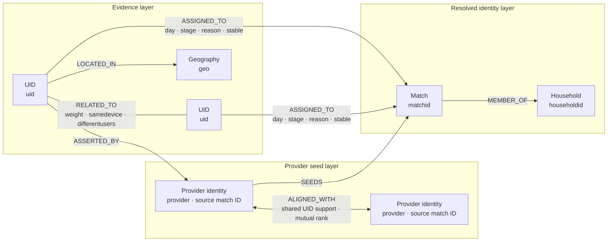
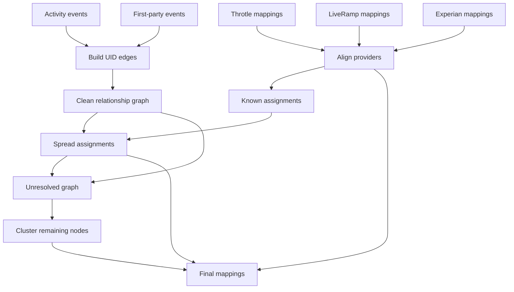
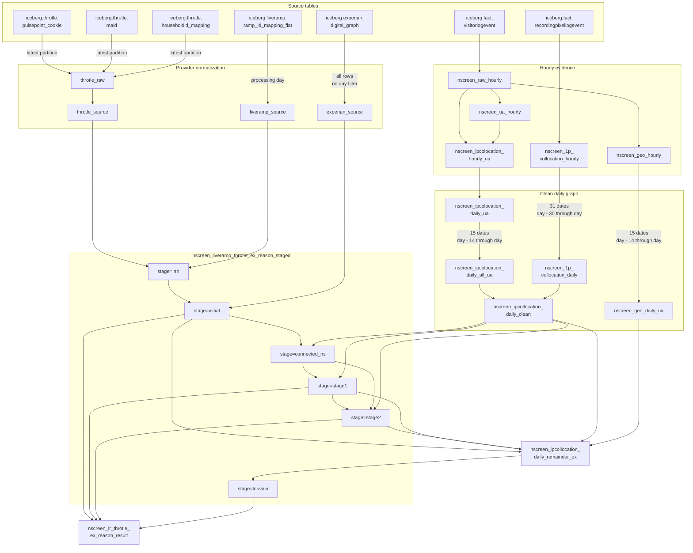

# NScreen Graph: Terse Guide

Normal guide lives here: [`graph-pipeline.md`](graph-pipeline.md).

## Scope

This guide covers core logic.
Production machinery stays excluded.

Focus stays on:

- SQL transformations
- relationship evidence
- matching rules
- provider alignment
- graph intelligence
- final identity mappings

## Purpose

NScreen Graph connects online identifiers.

One person exposes many identifiers.
One device exposes many identifiers.
One household contains many identifiers.

Project connects those identifiers.
Connections come from observed evidence.
Providers supply known mappings.

Final rows contain:

- `uid`
- `matchid`
- `householdid`
- `reason`
- `day`

`uid` means observed identifier.
`matchid` means person-like group.
`householdid` means household-like group.
`reason` explains assignment source.

Assignments remain educated guesses.
Shared IPs can mislead.
Several rules reduce mistakes.

## Graph model

Graph contains connected nodes.
Each UID becomes node.
Evidence becomes connecting edge.
Weight measures edge strength.
Communities become identity groups.



Known assignments become seeds.
Edges spread seed assignments.
Unresolved nodes get clustered.

Model stays logical.
Storage stays tabular.
No graph database exists.

Three model layers exist:

1. Evidence connects UID nodes.
2. Providers supply trusted seeds.
3. Resolution creates identity groups.

### Logical nodes

| Node | Key | Meaning |
| --- | --- | --- |
| `UID` | `uid` | Observed or synthetic identifier |
| `Provider identity` | provider plus source match ID | Provider-specific identity assertion |
| `Match` | `matchid` | Person-like identity group |
| `Household` | `householdid` | Household-like identity group |
| `Geography` | `geo` | Winning three-character postal prefix |

Stable matches gain `S_` prefix.
Household values can stay blank.

### Logical relationships

| Relationship | Meaning | Stored form |
| --- | --- | --- |
| `UID RELATED_TO UID` | Clean relationship evidence | `uid1`, `uid2`, `weight`, `samedevice`, `differentusers` |
| `UID LOCATED_IN Geography` | Selected daily UID geography | `uid`, `geo` |
| `UID ASSERTED_BY Provider identity` | Direct provider mapping | Provider source rows |
| `Provider identity ALIGNED_WITH Provider identity` | Mutually strongest provider mapping | Temporary counts and ranks |
| `UID ASSIGNED_TO Match` | Resolved identity assignment | Staged assignment row |
| `Match MEMBER_OF Household` | Match household membership | Assignment `householdid` |

Clean edges merge evidence sources.
Source type then disappears.
Geography supports unresolved clustering.

Staged assignments contain:

- `day`
- `stage`
- `uid`
- `matchid`
- `householdid`
- `stable`
- `reason`

Final rows drop stage.
Final rows encode stability.

## Core words

| Term | Meaning |
| --- | --- |
| UID | User-related identifier |
| IP address | Network address |
| User agent | Browser device-description text |
| Cookie | Browser-stored identifier |
| MAID | Mobile advertising identifier |
| IFA | Advertising identifier |
| EID | External event identifier |
| GUID | Unique linking identifier |
| First-party | Collected through owned interactions |
| Collocation | Identifiers observed together |
| Inference | Conclusion estimated from evidence |
| Edge | Relationship between UIDs |
| Weight | Relationship-strength score |
| Boolean | True-or-false value |
| Hash | Numeric value fingerprint |
| Murmur3 | Hashing algorithm used here |
| SQL | Table-transformation language |
| Query | SQL transformation instruction |
| Join | Rows combined through matches |
| Grouping | Rows combined through shared values |
| Ranking | Rows ordered within groups |
| Window function | Calculation across related rows |
| UDF | Custom per-row SQL function |
| UDAF | Custom grouped SQL function |
| Partition | Table slice by time values |
| Lookback | Historical date range |
| Louvain | Graph-community discovery algorithm |
| Label propagation | Neighbor-based grouping algorithm |

## Main sources

| Source | Evidence supplied |
| --- | --- |
| `iceberg.fact.visitorlogevent` | UID, IP, device, location |
| `iceberg.fact.recordingpixellogevent` | First-party UID links |
| Throtle tables | Known identity mappings |
| `iceberg.liveramp.ramp_id_mapping_flat` | LiveRamp identity mappings |
| `iceberg.experian.digital_graph` | Experian identity mappings |

Activity builds relationship graph.
Providers seed known identities.

## Core flow



Four broad phases exist:

1. Build relationship evidence.
2. Normalize provider mappings.
3. Spread known assignments.
4. Cluster unresolved relationships.

### Global table dependencies

Crossscreen names omit `iceberg.crossscreen.`.
Plain edges use current partition.
Labels show inclusive lookbacks.

Several nodes share one table.
Their `stage` partitions differ.



## Core custom functions

| Function | Purpose |
| --- | --- |
| `hudf_normalize_ip_address` | Standardizes IP values |
| `hudf_parse_ua` | Parses device descriptions |
| `hudf_is_same_device` | Detects likely shared devices |
| `hudf_different_users` | Detects likely different people |
| `murmur3` | Hashes identifier values |
| `hudf_calc_screen7_ids_udaf` | Calculates graph identity groups |

Business logic lives inside SQL.
Custom functions add special intelligence.

## Hourly evidence

### 1. Clean activity

Task: `NScreenRawHourly`

SQL: [`NScreenRawHourly.sql`](../../src/nscreen_graph/spark/sparksql/NScreenRawHourly.sql)

Input: `iceberg.fact.visitorlogevent`

Output: `nscreen_raw_hourly`

Processing rules:

1. Keep `USA`, `DEU`, `ESP`, `FRA`, `GBR`, `ITA`.
2. Exclude NAICS `517112`, `518210`.
3. Normalize every IP.
4. Collect candidate UIDs.
5. Reject malformed UIDs.
6. Expand UID arrays.
7. Deduplicate IP-UID pairs.
8. Count UIDs per IP.
9. Keep counts two-eight.
10. Calculate inverse-count weight.

Weight equals `1 / uid_count`.
Crowded IPs become weaker.
Huge shared networks disappear.

Candidate UID fields include:

- `visitorguid`
- `deviceid`
- `eids`

UIDs need 11-512 characters.
Placeholder-only UIDs get rejected.

### 2. Parse devices

Task: `NScreenUaHourly`

SQL: [`NScreenUaHourly.sql`](../../src/nscreen_graph/spark/sparksql/NScreenUaHourly.sql)

Function `hudf_parse_ua` extracts:

- device class
- device name
- operating system
- operating-system version
- browser
- browser version

Those fields support device comparisons.

### 3. Build IP edges

Task: `NScreenIpColocationHourlyUa`

SQL: [`NScreenIpColocationHourlyUa.sql`](../../src/nscreen_graph/spark/sparksql/NScreenIpColocationHourlyUa.sql)

Query joins rows by IP.
Shared IP creates candidate edge.

`uid1 < uid2` prevents duplicates.
Each pair appears once.

Per pair, query:

1. Sums relationship weights.
2. Attaches device descriptions.
3. Calls `hudf_is_same_device`.
4. Calls `hudf_different_users`.

`samedevice` suggests shared hardware.
`differentusers` suggests distinct people.

Hourly flags use strings.
Daily SQL casts Booleans.

### 4. Record geography

Task: `NScreenGeoHourly`

SQL: [`NScreenGeoHourly.sql`](../../src/nscreen_graph/spark/sparksql/NScreenGeoHourly.sql)

Query keeps UID locations.
Empty locations get removed.

Stored fields include:

- `uid`
- `country`
- `postalcode`

### 5. Build first-party edges

Task: `NScreenFirstPartyCollocationHourly`

SQL: [`NScreenFirstPartyCollocationHourly.sql`](../../src/nscreen_graph/spark/sparksql/NScreenFirstPartyCollocationHourly.sql)

Input: `recordingpixellogevent`

Shared GUID links identifiers.

Candidate identifiers include:

- visitor UID with `visitorstatus = 3`
- 36-character advertising IFA
- selected external IDs

All-zero IFAs get rejected.

Accepted EID prefixes:

- `FP`
- `MA`
- `I5`

Empty identifiers get removed.

Prefix meanings remain undocumented.
Duplicate pairs get removed.

## Daily graph construction

### 1. Aggregate daily IP edges

Task: `NScreenIpColocationDailyUa`

SQL: [`NScreenIpColocationDailyUa.sql`](../../src/nscreen_graph/spark/sparksql/NScreenIpColocationDailyUa.sql)

Hourly pair weights get summed.

Flag rules differ:

- Any `samedevice` wins.
- Every `differentusers` must agree.

Same-device evidence needs one hit.
Different-user evidence needs consistency.

### 2. Aggregate recent history

Task: `NScreenIpColocationDailyAllUa`

SQL: [`NScreenIpColocationDailyAllUa.sql`](../../src/nscreen_graph/spark/sparksql/NScreenIpColocationDailyAllUa.sql)

Offset uses 14 days.
Both endpoints get included.
Therefore 15 dates get read.

Pair weights get summed.
Pairs need three date appearances.
One-off coincidences disappear.

### 3. Aggregate first-party history

Task: `NScreenFirstPartyCollocationDaily`

SQL: [`NScreenFirstPartyCollocationDaily.sql`](../../src/nscreen_graph/spark/sparksql/NScreenFirstPartyCollocationDaily.sql)

Offset uses 30 days.
Both endpoints get included.
Therefore 31 dates get read.

Appearance counts become weights.
Trusted evidence gets longer history.

### 4. Merge and prune

Task: `NScreenIpCollocationDailyClean`

SQL: [`NScreenIpCollocationDailyClean.sql`](../../src/nscreen_graph/spark/sparksql/NScreenIpCollocationDailyClean.sql)

Query combines:

- historical IP edges
- historical first-party edges

First-party edges become:

- `samedevice = true`
- `differentusers = false`

Duplicate edges get merged.
Maximum weight survives.
Boolean clues get combined.

Neighbors get ranked by weight.
Each endpoint keeps ten.
Both rankings must pass.

Weak edges disappear.
Highly connected UIDs shrink.

### 5. Choose UID geography

Task: `NScreenGeoDaily`

SQL: [`NScreenGeoDaily.sql`](../../src/nscreen_graph/spark/sparksql/NScreenGeoDaily.sql)

Query reads 15 dates.
Postal codes keep three characters.
Most frequent prefix wins.
Winning prefix becomes `geo`.

## Provider preparation

Providers supply identity seeds.

### Throtle

Tasks:

- `NScreenThrotleRaw`
- `NScreenThrotleSource`

SQL files:

- [`NScreenThrotleRaw.sql`](../../src/nscreen_graph/spark/sparksql/NScreenThrotleRaw.sql)
- [`NScreenThrotleSource.sql`](../../src/nscreen_graph/spark/sparksql/NScreenThrotleSource.sql)

Raw query joins:

- mobile IDs
- PulsePoint cookies
- Throtle IDs
- household IDs

PulsePoint rows need `type = 'monthly'`.
MAID rows use latest source date.
PulsePoint rows use latest date onward.
Household rows use latest source date.
Empty or placeholder source UIDs disappear.
Empty Throtle IDs disappear.
Empty household IDs disappear.

Source query hashes IDs.
Throtle ID becomes `matchid`.
Household ID becomes `householdid`.

Synthetic UID format:

```text
TH_<throtleid>
```

`throtle` spelling remains intentional.
Existing names depend upon it.

### LiveRamp

Task: `NScreenLiverampSource`

SQL: [`NScreenLiverampSource.sql`](../../src/nscreen_graph/spark/sparksql/NScreenLiverampSource.sql)

Ramp IDs get hashed.
Household IDs get hashed.

Synthetic UID format:

```text
LR_<ramp_id>
```

Ramp IDs starting `XY` become stable.
Stable identities receive preference.

Ramp IDs need over 20 characters.
Observed UIDs need 12-39 characters.
Placeholder-only UIDs get rejected.
Only selected source-date rows participate.

### Experian

Task: `NScreenExperianSource`

SQL: [`NScreenExperianSource.sql`](../../src/nscreen_graph/spark/sparksql/NScreenExperianSource.sql)

Accepted source types:

- `PULSEPOINT`
- `HARDWARE_IDFA`
- `HARDWARE_ANDROID_AD_ID`
- `HARDWARE_TV`
- `TAPAD_COOKIE`

Person-like values get hashed.
Household values get hashed.

Helper prefixes include:

- `TA_`
- `EP_`
- `EL_`

`value` must be non-empty.
Person source value must exist.
Accepted types stay limited above.
Non-empty `pid` creates `EP_` UID.
Non-empty `luid` creates `EL_` UID.

Query applies no day filter.
All accepted source rows participate.

## Provider alignment

Providers use different match IDs.
Shared UIDs translate those namespaces.

### LiveRamp plus Throtle

Task: `NScreenLiverampThrotleOnlyStage`

SQL: [`NScreenLiverampThrotleOnlyStage.sql`](../../src/nscreen_graph/spark/sparksql/NScreenLiverampThrotleOnlyStage.sql)

Processing steps:

1. Join providers by UID.
2. Count ID-pair support.
3. Rank both mapping directions.
4. Keep mutual strongest pairings.
5. Reject ambiguous ties.
6. Prefer LiveRamp match IDs.
7. Preserve provider-only identities.

Reason codes become:

- `LR`
- `TH`
- `LRTH`

Mutual ranking prevents over-merging.

### Add Experian

Task: `NScreenLiverampThrotleExInitialStage`

SQL: [`NScreenLiverampThrotleExInitialStage.sql`](../../src/nscreen_graph/spark/sparksql/NScreenLiverampThrotleExInitialStage.sql)

Same mutual-ranking logic repeats.
Experian matches existing identities.
Unmatched Experian identities survive.

Matched reasons append `EX`.
Unmatched reason becomes `EX`.

Results become initial seeds.

## Identity propagation

### Select connected seeds

Task: `NScreenLiverampThrotleExConnectedNsStage`

SQL: [`NScreenLiverampThrotleExConnectedNsStage.sql`](../../src/nscreen_graph/spark/sparksql/NScreenLiverampThrotleExConnectedNsStage.sql)

Query keeps graph-connected seeds.
Disconnected provider rows stay unused.

### Spread twice

Task: `NScreenLiverampThrotleExNStage`

SQL: [`NScreenLiverampThrotleExNStage.sql`](../../src/nscreen_graph/spark/sparksql/NScreenLiverampThrotleExNStage.sql)

Two stages run:

- `stage1`
- `stage2`

Each stage:

1. Makes edges bidirectional.
2. Finds assigned neighbors.
3. Sums candidate support.
4. Doubles stable weights.
5. Skips assigned UIDs.
6. Picks strongest candidate.
7. Limits ten UIDs.
8. Assigns reason `IC`.

Stage one reaches neighbors.
Stage two reaches farther.
Maximum reach equals two hops.

One hop means one edge.

Two controls prevent expansion:

- one candidate per UID
- ten UIDs per match

## Remainder clustering

### Select unresolved edges

Task: `NScreenIpCollocationDailyExRemainder`

SQL: [`NScreenIpCollocationDailyExRemainder.sql`](../../src/nscreen_graph/spark/sparksql/NScreenIpCollocationDailyExRemainder.sql)

Query removes assigned UIDs.
Removed stages include:

- `initial`
- `stage1`
- `stage2`

Both endpoints need geography.
Both geographies must match.

### Calculate new groups

Task: `NScreenExRemainderLouvainStage`

SQL: [`NScreenExRemainderLouvainStage.sql`](../../src/nscreen_graph/spark/sparksql/NScreenExRemainderLouvainStage.sql)

Each geography gets processed separately.
UID strings become numeric hashes.

Function receives:

- `uid1`
- `uid2`
- `weight`
- `samedevice`
- `differentusers`

`hudf_calc_screen7_ids_udaf` then:

1. Groups same-device UIDs.
2. Limits five UIDs per device.
3. Collapses graph by device.
4. Forms preliminary households.
5. Limits 50 devices.
6. Runs Louvain inside households.
7. Honors different-user conflicts.
8. Collapses graph by match.
9. Regroups final households.
10. Limits 100 match IDs.

SQL keeps match IDs.
SQL keeps household IDs.
Device IDs get discarded.

Reason becomes `LU`.
Stable becomes false.

## Final result

Task: `NScreenLrThrotleExReasonResult`

SQL: [`NScreenLrThrotleExReasonResult.sql`](../../src/nscreen_graph/spark/sparksql/NScreenLrThrotleExReasonResult.sql)

Final table:

```text
iceberg.crossscreen.nscreen_lr_throtle_ex_reason_result
```

Included stages:

- `initial`
- `stage1`
- `stage2`
- `louvain`

Output columns:

| Column | Meaning |
| --- | --- |
| `day` | Result date |
| `uid` | Observed or synthetic identifier |
| `matchid` | Person-like assignment |
| `householdid` | Household-like assignment |
| `reason` | Assignment evidence code |

Final cleanup:

- Prefix stable IDs using `S_`.
- Remove rows with zero match IDs.
- Convert zero household IDs to empty strings.
- Remove placeholder-only UIDs.
- Remove synthetic `LR_` nodes from IP-only assignments.

Only four stages become final:

- `initial`
- `stage1`
- `stage2`
- `louvain`

Provider-supported `LR_` nodes survive.
IP-only `LR_` nodes disappear.

### Reason codes

| Code | Meaning |
| --- | --- |
| `LR` | LiveRamp evidence |
| `TH` | Throtle evidence |
| `EX` | Experian evidence |
| `IC` | IP-collocation propagation |
| `LU` | Louvain clustering |
| `NA` | Intermediate connected seed |

Provider codes can concatenate.
`LRTH` means aligned providers.
`LRTHEX` includes Experian alignment.

`NA` never reaches final output.

## Complete task order

1. `NScreenRawHourly`
2. `NScreenUaHourly`
3. `NScreenIpColocationHourlyUa`
4. `NScreenFirstPartyCollocationHourly`
5. `NScreenGeoHourly`
6. `NScreenIpColocationDailyUa`
7. `NScreenIpColocationDailyAllUa`
8. `NScreenFirstPartyCollocationDaily`
9. `NScreenIpCollocationDailyClean`
10. `NScreenGeoDaily`
11. `NScreenThrotleRaw`
12. `NScreenThrotleSource`
13. `NScreenLiverampSource`
14. `NScreenExperianSource`
15. `NScreenLiverampThrotleOnlyStage`
16. `NScreenLiverampThrotleExInitialStage`
17. `NScreenLiverampThrotleExConnectedNsStage`
18. `NScreenLiverampThrotleExNStage`
19. `NScreenIpCollocationDailyExRemainder`
20. `NScreenExRemainderLouvainStage`
21. `NScreenLrThrotleExReasonResult`

## Main intermediate tables

| Table | Core role |
| --- | --- |
| `nscreen_raw_hourly` | Clean activity observations |
| `nscreen_ua_hourly` | Parsed device descriptions |
| `nscreen_ipcolocation_hourly_ua` | Hourly shared-IP edges |
| `nscreen_geo_hourly` | Hourly UID geography |
| `nscreen_1p_collocation_hourly` | Hourly first-party edges |
| `nscreen_ipcolocation_daily_ua` | Daily shared-IP relationships |
| `nscreen_ipcolocation_daily_all_ua` | Repeated IP relationships |
| `nscreen_1p_collocation_daily` | Historical first-party relationships |
| `nscreen_ipcollocation_daily_clean` | Combined clean graph |
| `nscreen_geo_daily_ua` | Primary UID geography |
| `throtle_raw` | Raw Throtle links |
| `throtle_source` | Hashed Throtle mappings |
| `liveramp_source` | Hashed LiveRamp mappings |
| `experian_source` | Hashed Experian mappings |
| `nscreen_liveramp_throtle_ex_reason_staged` | All identity stages |
| `nscreen_ipcollocation_daily_remainder_ex` | Unassigned local edges |
| `nscreen_lr_throtle_ex_reason_result` | Final identity mapping |

## Core rules

- Reject malformed UIDs early.
- Reject placeholder-only provider IDs.
- Ignore tiny IP groups.
- Ignore huge IP groups.
- Weaken crowded-IP evidence.
- Require repeated shared-IP evidence.
- Trust first-party edges more.
- Keep strongest mutual neighbors.
- Align providers through shared UIDs.
- Reject ambiguous provider mappings.
- Prefer stable provider assignments.
- Reject invalid LiveRamp source rows.
- Reject invalid Experian source rows.
- Spread assignments two hops.
- Limit match expansion.
- Exclude already assigned UIDs.
- Cluster only matching geographies.
- Honor different-user clues.
- Preserve reasons for assignments.

## Reading order

1. Read `NScreenRawHourly.sql`.
2. Follow remaining hourly SQL.
3. Read daily graph SQL.
4. Read provider source SQL.
5. Read provider alignment SQL.
6. Read propagation stage SQL.
7. Read remainder clustering SQL.
8. Finish with result SQL.

## Known gaps

`helm/BUILD` names adhoc task `NScreenIpColocationDailyUaRunner`.
Class does not exist.
Only `NScreenIpColocationDailyUa` exists.
Adhoc job would fail.

`tasks/runner.py` stays empty.
No central `hourlies`/`complete_dailies` list here.
Repo-wide `CLAUDE.md` pattern skipped.
Scheduling comes from `helm/BUILD` directly.

## Summary

Provider mappings create trusted seeds.
Activity creates relationship edges.
SQL cleans both evidence types.
Provider namespaces get aligned.
Known assignments spread carefully.
Unresolved nodes get clustered.
Reason codes preserve explainability.
