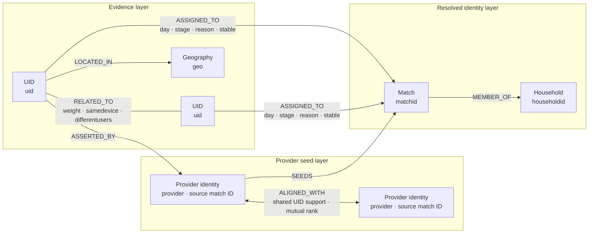
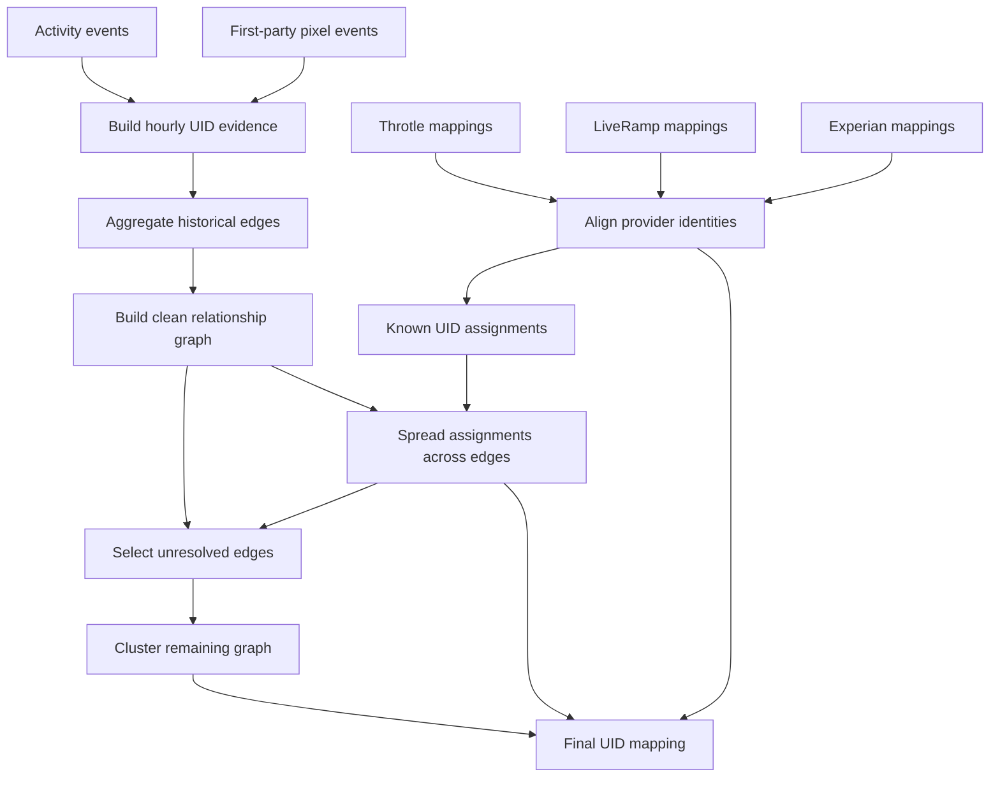
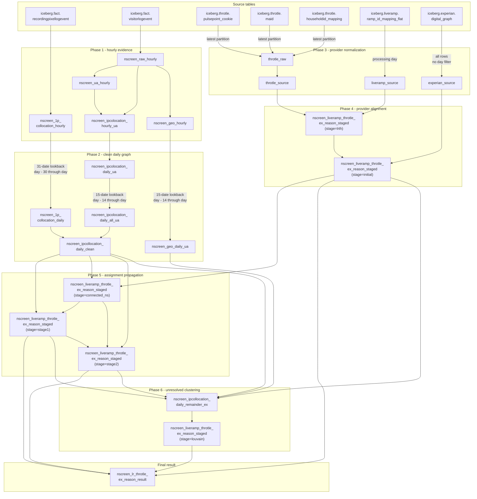
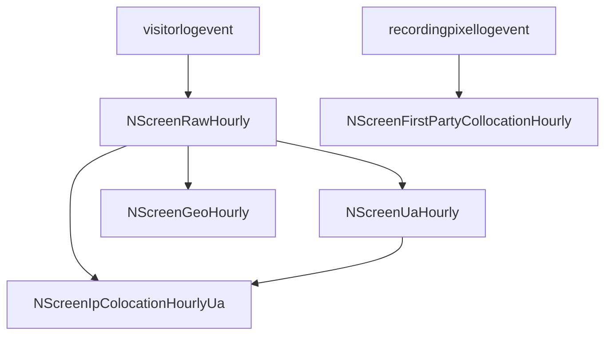
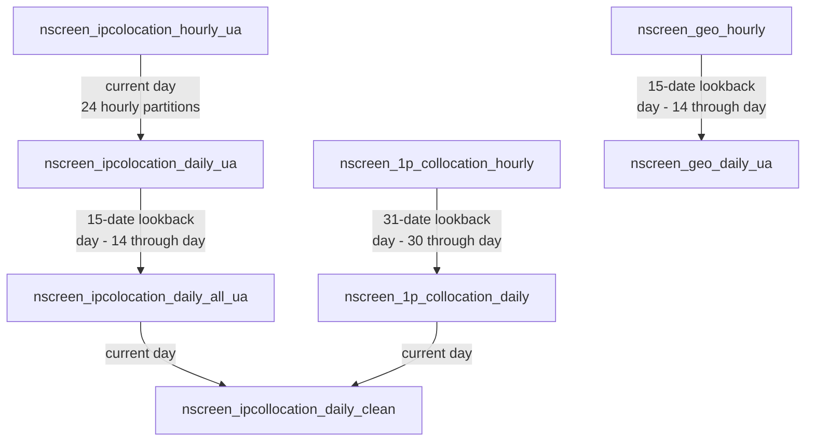
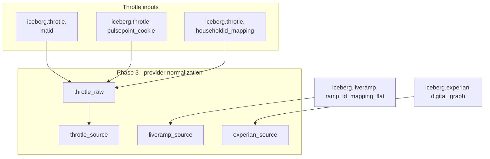
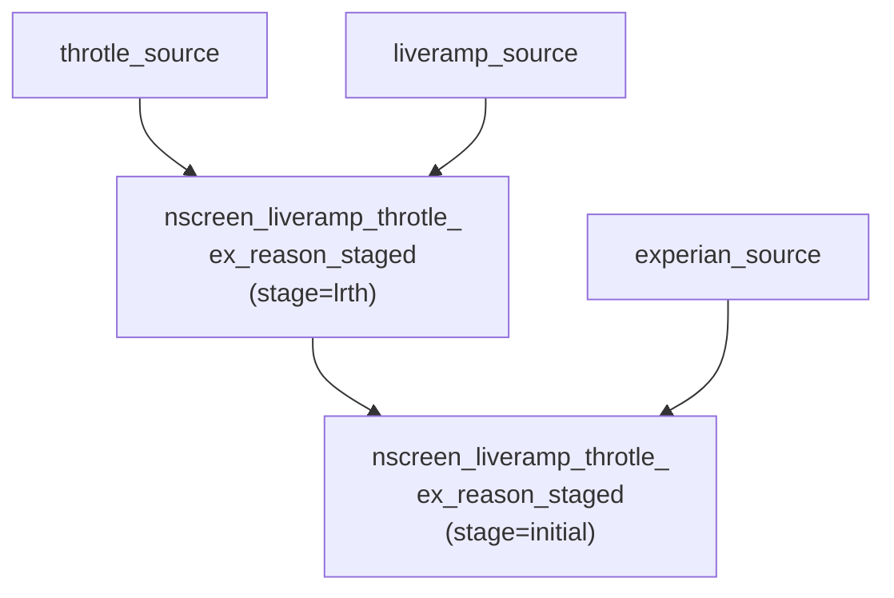
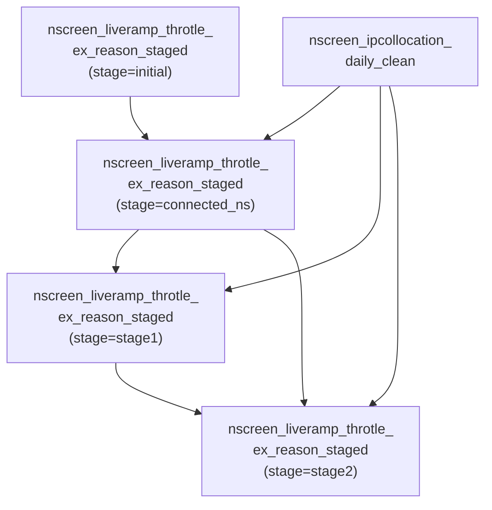
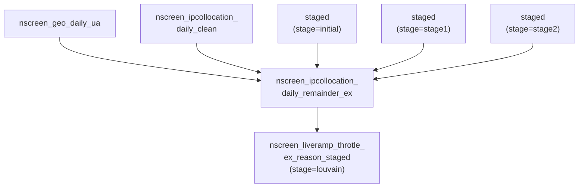

# NScreen Graph: A Beginner's Guide

> A shorter, deliberately terse version is available in [`graph-pipeline-caveman.md`](graph-pipeline-caveman.md).

## Scope

This guide explains the data, SQL transformations, matching rules, and graph logic inside `nscreen_graph`. It focuses entirely on the core identity idea rather than how jobs are operated.

## What NScreen Graph does

NScreen Graph connects different online identifiers that probably belong to the same device, person, or household.

An **online identifier** is a value used to recognize a browser, mobile device, account, or identity-provider record. Examples include browser cookies, mobile advertising IDs, and identifiers supplied by LiveRamp, Throtle, or Experian.

One real person can appear under many identifiers:

```text
Browser cookie:         cookie_A
Mobile advertising ID: mobile_B
Provider identifier:   provider_C
```

The pipeline tries to discover relationships between those identifiers. Its final table maps each user identifier, called a `uid`, to:

- a `matchid`, representing a person-like identity group;
- a `householdid`, representing a household-like identity group;
- a `reason`, explaining where the assignment came from; and
- a `day`, identifying the date represented by the result.

These assignments are based on evidence, not proof. Two identifiers sharing an IP address might belong to one person, one household, unrelated people using public Wi-Fi, or automated traffic. The SQL uses history, weights, device clues, trusted provider data, and graph limits to reduce bad matches.

## Why it is called a graph

A **graph** contains nodes connected by edges:

- A **node** is one UID.
- An **edge** is evidence connecting two UIDs.
- An edge's **weight** measures connection strength.
- A **cluster** or **community** is a group of strongly connected nodes.

Here is a simplified example:

```text
cookie_A ----- shared IP ----- mobile_B
    |
    +--------- LiveRamp ----- match_123
```

If `cookie_A` already belongs to `match_123`, and `mobile_B` has strong evidence connecting it to `cookie_A`, the pipeline may assign `mobile_B` to `match_123` too.

The final product is a table of mappings, not a visual graph.

### Graph data model

The pipeline can be understood as the following logical property graph. This is a conceptual model for the SQL data; the project does not store these objects in a graph database.



The model has three layers:

1. The **evidence layer** connects UIDs using repeated shared-IP observations or first-party GUID links. It also records the selected geography used when clustering unresolved UIDs.
2. The **provider seed layer** represents mappings supplied by LiveRamp, Throtle, and Experian. Shared UIDs align provider-specific identity namespaces using uniquely strongest mappings in both directions.
3. The **resolved identity layer** assigns each UID to a person-like match and, when available, a household-like group. Provider seeds, two propagation stages, and Louvain clustering can create these assignments.

#### Logical nodes

| Node | Key | Description |
| --- | --- | --- |
| `UID` | `uid` | An observed cookie, device ID, EID, or synthetic provider identifier. |
| `Provider identity` | provider plus source match ID | A provider-specific person and household assertion used as an identity seed. |
| `Match` | `matchid` | A resolved person-like identity group. Stable groups receive an `S_` prefix in the final result. |
| `Household` | `householdid` | A resolved household-like group containing one or more person-like matches. It can be blank in the final result. |
| `Geography` | `geo` | The most frequently observed three-character postal-code prefix for a UID during the 15-date lookback. |

#### Logical relationships

| Relationship | Meaning | SQL representation |
| --- | --- | --- |
| `UID RELATED_TO UID` | Clean identity evidence between two UIDs. | `uid1`, `uid2`, `weight`, `samedevice`, and `differentusers` in `nscreen_ipcollocation_daily_clean`. Shared-IP and first-party edges are merged before this table, so their source type is not retained. |
| `UID LOCATED_IN Geography` | The selected daily geography for a UID. | `uid` and `geo` in `nscreen_geo_daily_ua`. Geography is required only for unresolved-edge clustering. |
| `UID ASSERTED_BY Provider identity` | A source provider directly maps a UID to person-like and household-like identifiers. | Provider source tables containing `uid`, `matchid`, `householdid`, and, for LiveRamp-derived mappings, `stable`. |
| `Provider identity ALIGNED_WITH Provider identity` | Provider namespaces describe the same likely identity. | Temporary shared-UID support counts and bidirectional ranks in the provider-alignment SQL. Ambiguous strongest ties are rejected. |
| `UID ASSIGNED_TO Match` | A UID receives a resolved match through provider data, propagation, or clustering. | `day`, `stage`, `uid`, `matchid`, `householdid`, `stable`, and `reason` in `nscreen_liveramp_throtle_ex_reason_staged`. |
| `Match MEMBER_OF Household` | A person-like match belongs to a household-like group. | `householdid` stored on each assignment row rather than in a separate edge table. |

The final table flattens the resolved layer into one row per UID assignment. It keeps `day`, `uid`, `matchid`, `householdid`, and `reason`; `stage` and `stable` remain intermediate concepts. Final stable match and household values encode stability with the `S_` prefix.

## Core terminology

| Term | Meaning |
| --- | --- |
| UID | A user-related identifier observed by the system. |
| IP address | A network address used by a device while communicating online. |
| User agent | Text describing a browser, operating system, and device. |
| Cookie | A value stored by a browser and reused across requests. |
| MAID | A mobile advertising identifier. |
| IFA | An identifier used for advertising, usually associated with a device. |
| EID | An external identifier contained in an event. |
| GUID | A globally unique identifier used here as a linking key. |
| First-party data | Data collected through interactions controlled by the organization itself. |
| Collocation | Two identifiers being observed together, such as behind the same IP address. |
| Inference | A conclusion estimated from evidence rather than supplied directly. |
| Weight | A number representing relationship strength. |
| Boolean | A value that is either `true` or `false`. |
| Hash | A numeric fingerprint calculated from another value. |
| Murmur3 | The hashing algorithm used by this project. |
| SQL | A language used to read and transform table-shaped data. |
| Query | A SQL instruction that reads or transforms data. |
| Join | Combining rows by matching selected values. |
| Grouping | Combining rows that share selected values. |
| Ranking | Ordering rows within a group. |
| Window function | A calculation performed across a related group of rows. |
| UDF | A custom function called from SQL for each row. |
| UDAF | A custom function that processes many rows together. |
| Partition | A table slice selected by values such as `day` or `hour`. |
| Lookback window | A historical date range ending on the processing date. |
| Louvain | An algorithm that divides a graph into strongly connected communities. |
| Label propagation | A grouping algorithm where nodes adopt labels based on nearby nodes. |

## Main data sources

The core logic combines five kinds of data.

| Source | What it contributes |
| --- | --- |
| `iceberg.fact.visitorlogevent` | UID, IP, user-agent, country, and postal-code observations. |
| `iceberg.fact.recordingpixellogevent` | First-party links between identifiers sharing a GUID. |
| Throtle tables | Provider-supplied UID, person-like, and household-like mappings. |
| `iceberg.liveramp.ramp_id_mapping_flat` | LiveRamp UID, Ramp ID, and household mappings. |
| `iceberg.experian.digital_graph` | Experian UID, person, and household mappings. |

The source providers supply known identity mappings. Activity events supply observed relationships. The pipeline uses provider mappings as seeds, then extends them through relationship evidence.

## Transformation overview



The process has four broad phases:

1. Build UID-to-UID evidence from activity.
2. Normalize and align provider mappings.
3. Spread known assignments through strong edges.
4. Cluster the remaining unresolved graph.

### Global table dependency graph

Crossscreen table names below omit the `iceberg.crossscreen.` prefix. Unlabeled edges read the current processing partition. Lookback labels show inclusive date ranges.

Several nodes represent `stage` partitions in the same physical table, `nscreen_liveramp_throtle_ex_reason_staged`.



## Shared SQL functions

The SQL transformations use several custom functions. Their names show where specialized identity logic enters the process.

| Function | Core purpose |
| --- | --- |
| `hudf_normalize_ip_address` | Converts IP addresses into a consistent format. |
| `hudf_parse_ua` | Parses user-agent text into device and browser fields. |
| `hudf_is_same_device` | Returns true when two UIDs have compatible device, OS, and browser profiles after normalizing known equivalent values. Distinct device identifiers never match. |
| `hudf_different_users` | Returns true when two UIDs have the same supported device class but fail the same-device check. It is not the inverse of `hudf_is_same_device`. |
| `murmur3` | Converts source identifiers into numeric hashes. |
| `hudf_calc_screen7_ids_udaf` | Groups unresolved graph edges into device, match, and household identities. |

SQL alone does not contain their full decision logic, so each function's purpose matters when reading a query.

## Phase 1: build hourly relationship evidence

The hourly transformations create three kinds of evidence:

- shared-IP edges;
- first-party edges; and
- geographic observations.



### Step 1: clean activity observations

Task: `NScreenRawHourly`

SQL: [`NScreenRawHourly.sql`](https://github.com/pulsepointinc/forge/tree/b38ea8548ddbc957a674591372f1a0d1fd7e631f/nscreen-graph/src/nscreen_graph/spark/sparksql/NScreenRawHourly.sql)

Input:

- `iceberg.fact.visitorlogevent`

Output:

- `iceberg.crossscreen.nscreen_raw_hourly`

For one day and hour, the SQL does the following:

1. Keeps events from `USA`, `DEU`, `ESP`, `FRA`, `GBR`, and `ITA`.
2. Excludes selected NAICS categories. **NAICS** is an industry-classification system. The exclusion appears intended to remove network or hosting traffic that can create misleading shared-IP evidence.
3. Normalizes each IP with `hudf_normalize_ip_address`.
4. Collects candidate UIDs from `visitorguid`, `deviceid`, and pipe-separated `eids`.
5. Rejects malformed identifiers with text-pattern checks.
6. Expands each identifier array into separate rows with `explode`.
7. Deduplicates each IP-and-UID pair.
8. Counts distinct UIDs behind each IP.
9. Keeps IPs containing between two and eight UIDs.
10. Assigns each row a weight of `1 / uid_count`.

The limits are part of the intelligence:

- One UID behind an IP provides no relationship.
- A very crowded IP could represent an office, public network, carrier, hosting system, or bots.
- Keeping two through eight UIDs favors smaller and more useful groups.
- Using `1 / uid_count` makes crowded IPs weaker than small groups.

### Step 2: understand device descriptions

Task: `NScreenUaHourly`

SQL: [`NScreenUaHourly.sql`](https://github.com/pulsepointinc/forge/tree/b38ea8548ddbc957a674591372f1a0d1fd7e631f/nscreen-graph/src/nscreen_graph/spark/sparksql/NScreenUaHourly.sql)

Input:

- `nscreen_raw_hourly`

Output:

- `nscreen_ua_hourly`

For each distinct user-agent string, `hudf_parse_ua` extracts:

- device class;
- device name;
- operating system and version; and
- browser and version.

These fields help the next query decide whether two UIDs look like the same physical device or like different people.

Quick UDF examples:

- `hudf_is_same_device`: same class, same normalized name/OS/browser/version → `true`. Diff browser (Chrome vs Firefox) on otherwise identical Desktop → `false`.
- `hudf_different_users`: same class (Phone/Desktop/Tablet) but `isSameDevice=false` → `true` (looks like different people). Mismatched device class, or a null field → `false`.

### Step 3: create shared-IP edges

Task: `NScreenIpColocationHourlyUa`

SQL: [`NScreenIpColocationHourlyUa.sql`](https://github.com/pulsepointinc/forge/tree/b38ea8548ddbc957a674591372f1a0d1fd7e631f/nscreen-graph/src/nscreen_graph/spark/sparksql/NScreenIpColocationHourlyUa.sql)

Inputs:

- `nscreen_raw_hourly`
- `nscreen_ua_hourly`

Output:

- `nscreen_ipcolocation_hourly_ua`

The query joins the raw observations to themselves on IP address. Each UID pair sharing an IP becomes a candidate graph edge.

The condition `uid1 < uid2` stores each pair once. Without it, both `X-Y` and `Y-X` would appear.

For each pair, the query:

1. sums relationship weights;
2. attaches parsed device descriptions;
3. calls `hudf_is_same_device`; and
4. calls `hudf_different_users`.

The output therefore contains connection strength plus two important clues:

- `samedevice`: the pair probably represents one physical device;
- `differentusers`: the pair probably represents different people.

The hourly table stores these flags as strings. The daily SQL casts them to Boolean values before combining them.

### Step 4: record geography

Task: `NScreenGeoHourly`

SQL: [`NScreenGeoHourly.sql`](https://github.com/pulsepointinc/forge/tree/b38ea8548ddbc957a674591372f1a0d1fd7e631f/nscreen-graph/src/nscreen_graph/spark/sparksql/NScreenGeoHourly.sql)

Input:

- `nscreen_raw_hourly`

Output:

- `nscreen_geo_hourly`

This query keeps distinct UID, country, and postal-code observations. Rows with missing UID or location values are discarded.

### Step 5: create first-party edges

Task: `NScreenFirstPartyCollocationHourly`

SQL: [`NScreenFirstPartyCollocationHourly.sql`](https://github.com/pulsepointinc/forge/tree/b38ea8548ddbc957a674591372f1a0d1fd7e631f/nscreen-graph/src/nscreen_graph/spark/sparksql/NScreenFirstPartyCollocationHourly.sql)

Input:

- `iceberg.fact.recordingpixellogevent`

Output:

- `nscreen_1p_collocation_hourly`

A recording-pixel event can contain several identifiers connected through the same `guid`. The query collects:

- a visitor UID when `visitorstatus = 3`;
- a valid 36-character advertising IFA; and
- external IDs whose prefixes are `FP`, `MA`, or `I5`.

The local code does not explain what those three prefixes expand to, so this guide does not guess.

Every pair sharing a GUID becomes an edge. Duplicate pairs are removed. Because this is first-party evidence, later SQL treats these edges as stronger same-device evidence.

## Phase 2: build a clean daily graph

Each node below is a table. Labeled edges show inclusive lookback windows.



### Step 1: aggregate hourly IP edges

Task: `NScreenIpColocationDailyUa`

SQL: [`NScreenIpColocationDailyUa.sql`](https://github.com/pulsepointinc/forge/tree/b38ea8548ddbc957a674591372f1a0d1fd7e631f/nscreen-graph/src/nscreen_graph/spark/sparksql/NScreenIpColocationDailyUa.sql)

The query groups all hourly observations for each UID pair and:

- sums their weights;
- sets `samedevice` when any observation says true; and
- keeps `differentusers` true only when every observation says true.

This is intentionally asymmetric. One convincing same-device observation is useful, while a different-user conclusion must remain consistent across observations.

### Step 2: keep repeated IP relationships

Task: `NScreenIpColocationDailyAllUa`

SQL: [`NScreenIpColocationDailyAllUa.sql`](https://github.com/pulsepointinc/forge/tree/b38ea8548ddbc957a674591372f1a0d1fd7e631f/nscreen-graph/src/nscreen_graph/spark/sparksql/NScreenIpColocationDailyAllUa.sql)

The query reads from `day - 14` through `day`, inclusive. This means it reads 15 calendar dates, despite the `_LOOKBACK_DAYS = 14` constant.

Across those dates, it:

1. sums pair weights;
2. combines the device flags; and
3. keeps only pairs appearing on at least three dates.

The three-date rule removes one-off coincidences. Repeated collocation is treated as stronger relationship evidence.

### Step 3: count first-party history

Task: `NScreenFirstPartyCollocationDaily`

SQL: [`NScreenFirstPartyCollocationDaily.sql`](https://github.com/pulsepointinc/forge/tree/b38ea8548ddbc957a674591372f1a0d1fd7e631f/nscreen-graph/src/nscreen_graph/spark/sparksql/NScreenFirstPartyCollocationDaily.sql)

This query reads from `day - 30` through `day`, inclusive, so it covers 31 calendar dates. It counts how often each first-party pair appeared and uses that count as the edge weight.

The longer window gives trusted first-party links more historical support.

### Step 4: merge and prune edges

Task: `NScreenIpCollocationDailyClean`

SQL: [`NScreenIpCollocationDailyClean.sql`](https://github.com/pulsepointinc/forge/tree/b38ea8548ddbc957a674591372f1a0d1fd7e631f/nscreen-graph/src/nscreen_graph/spark/sparksql/NScreenIpCollocationDailyClean.sql)

This query combines historical IP edges and historical first-party edges.

First-party edges are converted into:

- `samedevice = true`
- `differentusers = false`

When the same pair appears in both sources, the query keeps the maximum weight and combines the Boolean clues.

It then ranks every UID's neighbors by weight. An edge survives only when it is among the top ten neighbors for both endpoints.

This rule serves two purposes:

- It removes weak relationships.
- It prevents highly connected UIDs from dominating the graph.

The output is `nscreen_ipcollocation_daily_clean`, the main relationship graph used by later identity logic.

### Step 5: choose one geography per UID

Task: `NScreenGeoDaily`

SQL: [`NScreenGeoDaily.sql`](https://github.com/pulsepointinc/forge/tree/b38ea8548ddbc957a674591372f1a0d1fd7e631f/nscreen-graph/src/nscreen_graph/spark/sparksql/NScreenGeoDaily.sql)

This query uses the same 14-day offset, meaning 15 inclusive dates.

It shortens every postal code to its first three characters, counts observations for each UID and prefix, and uses `max_by` to select the most frequently observed prefix. That value becomes `geo`.

Geography is not used to create the initial provider-based assignments. It is used later to split and constrain the unresolved graph.

## Phase 3: normalize provider identities

Provider data supplies known mappings that become graph seeds. A **seed** is a UID that already has a person-like assignment from a provider.



### Throtle source

Tasks:

- `NScreenThrotleRaw`
- `NScreenThrotleSource`

SQL:

- [`NScreenThrotleRaw.sql`](https://github.com/pulsepointinc/forge/tree/b38ea8548ddbc957a674591372f1a0d1fd7e631f/nscreen-graph/src/nscreen_graph/spark/sparksql/NScreenThrotleRaw.sql)
- [`NScreenThrotleSource.sql`](https://github.com/pulsepointinc/forge/tree/b38ea8548ddbc957a674591372f1a0d1fd7e631f/nscreen-graph/src/nscreen_graph/spark/sparksql/NScreenThrotleSource.sql)

`NScreenThrotleRaw` reads the latest available rows from:

- `iceberg.throtle.maid`
- `iceberg.throtle.pulsepoint_cookie`
- `iceberg.throtle.householdid_mapping`

It connects mobile IDs and PulsePoint cookie IDs to Throtle IDs, then attaches available Throtle household IDs.

`NScreenThrotleSource` converts each Throtle ID into a numeric `matchid` with `murmur3`. Household IDs are hashed too.

It also creates one synthetic UID formatted like `TH_<throtleid>`. **Synthetic** means created by the transformation rather than observed directly.

The spelling `throtle` looks unusual, but it is part of existing task and table names. It should not be changed casually.

### LiveRamp source

Task: `NScreenLiverampSource`

SQL: [`NScreenLiverampSource.sql`](https://github.com/pulsepointinc/forge/tree/b38ea8548ddbc957a674591372f1a0d1fd7e631f/nscreen-graph/src/nscreen_graph/spark/sparksql/NScreenLiverampSource.sql)

Input:

- `iceberg.liveramp.ramp_id_mapping_flat`

The query hashes each Ramp ID into a numeric `matchid` and hashes available household IDs. It creates a synthetic UID formatted like `LR_<ramp_id>` for each Ramp ID.

Ramp IDs beginning with `XY` receive `stable = true`. In this logic, stable identifiers are preferred during propagation and receive an `S_` prefix in final output.

### Experian source

Task: `NScreenExperianSource`

SQL: [`NScreenExperianSource.sql`](https://github.com/pulsepointinc/forge/tree/b38ea8548ddbc957a674591372f1a0d1fd7e631f/nscreen-graph/src/nscreen_graph/spark/sparksql/NScreenExperianSource.sql)

Input:

- `iceberg.experian.digital_graph`

Accepted identifier types are:

- `PULSEPOINT`
- `HARDWARE_IDFA`
- `HARDWARE_ANDROID_AD_ID`
- `HARDWARE_TV`
- `TAPAD_COOKIE`

The query chooses a raw person-like value from `pid`, `ip`, or `household_id`, then hashes it into `matchid`. It hashes the household ID separately when available.

It also creates or normalizes helper UIDs:

- Tapad cookies receive `TA_`.
- Experian person IDs receive `EP_`.
- Experian local IDs receive `EL_`.

The source fields `pid` and `luid` are retained, but their exact business definitions belong to the source system.

Unlike most date-oriented inputs, this query does not filter `iceberg.experian.digital_graph` by day. It reads all rows that pass its identifier filters.

## Phase 4: align provider namespaces

Different providers can assign different match IDs to the same underlying person. Shared UIDs provide translation evidence between providers.



### Align LiveRamp and Throtle

Task: `NScreenLiverampThrotleOnlyStage`

SQL: [`NScreenLiverampThrotleOnlyStage.sql`](https://github.com/pulsepointinc/forge/tree/b38ea8548ddbc957a674591372f1a0d1fd7e631f/nscreen-graph/src/nscreen_graph/spark/sparksql/NScreenLiverampThrotleOnlyStage.sql)

The query:

1. joins LiveRamp and Throtle rows sharing a UID;
2. counts support for each LiveRamp-ID and Throtle-ID pairing;
3. ranks candidate mappings in both directions;
4. keeps pairings that are strongest from both directions;
5. rejects tied or ambiguous mappings;
6. prefers the LiveRamp match ID for accepted mappings; and
7. preserves provider-only identities when no accepted mapping exists.

This is a mutual-best matching rule. It prevents one popular provider ID from absorbing many uncertain IDs merely because they overlap once.

Accepted rows use reason codes:

- `LR` for LiveRamp only;
- `TH` for Throtle only; and
- `LRTH` when both providers align.

### Add Experian

Task: `NScreenLiverampThrotleExInitialStage`

SQL: [`NScreenLiverampThrotleExInitialStage.sql`](https://github.com/pulsepointinc/forge/tree/b38ea8548ddbc957a674591372f1a0d1fd7e631f/nscreen-graph/src/nscreen_graph/spark/sparksql/NScreenLiverampThrotleExInitialStage.sql)

This query repeats the same mutual-best mapping rule between Experian and the combined LiveRamp/Throtle identities.

Matched rows keep the combined assignment and append `EX` to the reason. Unmatched Experian identities remain under their own assignment with reason `EX`.

The resulting `initial` rows are the known identity seeds used by graph propagation.

## Phase 5: spread known assignments

Provider mappings do not cover every UID. The clean relationship graph extends those assignments.



### Select connected seeds

Task: `NScreenLiverampThrotleExConnectedNsStage`

SQL: [`NScreenLiverampThrotleExConnectedNsStage.sql`](https://github.com/pulsepointinc/forge/tree/b38ea8548ddbc957a674591372f1a0d1fd7e631f/nscreen-graph/src/nscreen_graph/spark/sparksql/NScreenLiverampThrotleExConnectedNsStage.sql)

This query keeps only initial UIDs that occur somewhere in the clean NScreen graph. These connected known UIDs become starting points for propagation.

### Observed versus expected inheritance

Current propagation only fills gaps. `filter_out_having_matchid` removes every UID that already has any assignment before candidates are ranked. A graph edge can therefore connect a LiveRamp UID to a UID carrying a Throtle or Experian matchid without changing either assignment.

The toy case makes this visible. `v9` already carries LiveRamp matchid `L1`; `v24`, `v25`, and `v26` already carry tie-rejected Throtle matchid `T6`; and clean NScreen edges connect each of them to `v9`. The pipeline copies all four into `connected_ns` with reason `NA`, then excludes all four from propagation because they are already assigned. The observed result remains `v9`→`L1` and `v24`/`v25`/`v26`→`T6`.

The expected result is provider-neutral. Strong IP-collocation or first-party evidence, supported by compatible device signals, should be able to reconcile already-assigned matchids from any provider. This includes LiveRamp-to-Throtle, Throtle-to-Throtle, LiveRamp-to-LiveRamp, and other combinations. In the toy case, sufficiently strong evidence should place `v9`, `v24`, `v25`, and `v26` under one canonical matchid; that matchid need not retain a particular vendor's identifier.

The final identity relation should be many-to-one: every published UID maps to exactly one matchid, while one matchid can contain many UIDs. [`provider-source-multi-assignment-plan.md`](../plans/provider-source-multi-assignment-plan.md) selects one vendor claim without dropping UIDs. Reconciliation of already-assigned groups using relationship evidence remains a separate design problem.

### Run two propagation rounds

Task: `NScreenLiverampThrotleExNStage`

SQL: [`NScreenLiverampThrotleExNStage.sql`](https://github.com/pulsepointinc/forge/tree/b38ea8548ddbc957a674591372f1a0d1fd7e631f/nscreen-graph/src/nscreen_graph/spark/sparksql/NScreenLiverampThrotleExNStage.sql)

The task runs twice, producing `stage1` and `stage2`.

Each round:

1. makes every edge usable in both directions;
2. finds neighbors that already have match IDs;
3. sums edge weights supporting each candidate match ID;
4. doubles the score for stable candidates;
5. removes UIDs that already have an assignment;
6. chooses the strongest candidate for each UID;
7. limits each match ID to ten newly assigned UIDs; and
8. assigns reason `IC`, meaning IP collocation.

Stage 1 reaches direct neighbors of known seeds. Stage 2 uses both original seeds and stage-1 results, so it can reach one additional graph hop. A **hop** means crossing one edge.

Two limits control over-expansion:

- Each UID receives only its strongest candidate.
- Each match ID receives at most ten UIDs per round.

## Phase 6: cluster unresolved relationships

Some UIDs remain unassigned after provider alignment and two propagation rounds.



### Select the remainder

Task: `NScreenIpCollocationDailyExRemainder`

SQL: [`NScreenIpCollocationDailyExRemainder.sql`](https://github.com/pulsepointinc/forge/tree/b38ea8548ddbc957a674591372f1a0d1fd7e631f/nscreen-graph/src/nscreen_graph/spark/sparksql/NScreenIpCollocationDailyExRemainder.sql)

The query:

1. removes UIDs already assigned in `initial`, `stage1`, or `stage2`;
2. requires geographic data for both endpoints; and
3. keeps only edges whose endpoints share the same `geo`.

This geographic restriction avoids clustering unrelated nodes across distant areas and divides the unresolved graph into smaller local groups.

### Calculate new identity groups

Task: `NScreenExRemainderLouvainStage`

SQL: [`NScreenExRemainderLouvainStage.sql`](https://github.com/pulsepointinc/forge/tree/b38ea8548ddbc957a674591372f1a0d1fd7e631f/nscreen-graph/src/nscreen_graph/spark/sparksql/NScreenExRemainderLouvainStage.sql)

For each `geo`, the query sends all remaining edges into `hudf_calc_screen7_ids_udaf`.

For a Java-free, step-by-step explanation of how UIDs remain grouped through
device, match, and household levels, see
[`UDAFCalcScreen7IdsEvaluator` grouping guide](../udaf-calc-screen7-ids-evaluator.md).

UID strings are first converted into numeric hashes with `murmur3`. After the function returns assignments, the SQL joins those hashes back to the original UID strings.

The custom calculator performs these high-level steps:

1. Use `samedevice` edges to group UIDs into device identities.
2. Limit each device identity to five UIDs.
3. Collapse the UID graph into a device-level graph.
4. Use label propagation to form preliminary households.
5. Limit preliminary households to 50 devices.
6. Run Louvain inside each household to form match communities.
7. Honor `differentusers` conflicts while creating match communities.
8. Collapse the graph again at match-ID level.
9. Regroup nearby match IDs into final households.
10. Limit final households to 100 match IDs.

The function calculates device, match, and household IDs. The SQL keeps only match and household IDs.

These assignments receive:

- `reason = 'LU'`
- `stable = false`

## Final result

Task: `NScreenLrThrotleExReasonResult`

SQL: [`NScreenLrThrotleExReasonResult.sql`](https://github.com/pulsepointinc/forge/tree/b38ea8548ddbc957a674591372f1a0d1fd7e631f/nscreen-graph/src/nscreen_graph/spark/sparksql/NScreenLrThrotleExReasonResult.sql)

Destination:

- `iceberg.crossscreen.nscreen_lr_throtle_ex_reason_result`

The final query combines:

- direct and aligned provider assignments from `initial`;
- inferred assignments from `stage1` and `stage2`; and
- newly clustered assignments from `louvain`.

It produces:

| Column | Meaning |
| --- | --- |
| `day` | Date represented by the result. |
| `uid` | Original observed or synthetic identifier. |
| `matchid` | Person-like identity-group assignment. |
| `householdid` | Household-like identity-group assignment, when available. |
| `reason` | Evidence code explaining the assignment source. |

Final cleanup does the following:

- Prefix stable match and household IDs with `S_`.
- Remove rows whose match ID equals zero.
- Convert household ID zero into an empty string.
- Remove selected invalid UID patterns.
- Remove synthetic `LR_` nodes assigned only through IP collocation.

### Reason codes

| Code fragment | Meaning |
| --- | --- |
| `LR` | LiveRamp supplied or supported the assignment. |
| `TH` | Throtle supplied or supported the assignment. |
| `EX` | Experian supplied or supported the assignment. |
| `IC` | The assignment came from graph propagation using IP-collocation evidence. |
| `LU` | The assignment came from unresolved-graph clustering. |
| `NA` | An intermediate marker for connected provider seeds. |

Provider fragments can concatenate. For example:

- `LRTH` means LiveRamp and Throtle aligned.
- `LRTHEX` means Experian aligned with that combined mapping.

`NA` is intermediate and does not appear in the final result.

## Complete transformation sequence

This list is the simplest way to follow the core logic in code:

1. `NScreenRawHourly` cleans UID, IP, device, and location observations.
2. `NScreenUaHourly` parses user-agent details.
3. `NScreenIpColocationHourlyUa` creates weighted shared-IP edges.
4. `NScreenFirstPartyCollocationHourly` creates first-party edges.
5. `NScreenGeoHourly` records geographic observations.
6. `NScreenIpColocationDailyUa` aggregates one day of shared-IP evidence.
7. `NScreenIpColocationDailyAllUa` keeps repeated recent relationships.
8. `NScreenFirstPartyCollocationDaily` counts first-party history.
9. `NScreenIpCollocationDailyClean` merges and prunes both edge sources.
10. `NScreenGeoDaily` chooses one common geography per UID.
11. `NScreenThrotleRaw` and `NScreenThrotleSource` normalize Throtle mappings.
12. `NScreenLiverampSource` normalizes LiveRamp mappings.
13. `NScreenExperianSource` normalizes Experian mappings.
14. `NScreenLiverampThrotleOnlyStage` aligns LiveRamp and Throtle.
15. `NScreenLiverampThrotleExInitialStage` adds Experian alignment.
16. `NScreenLiverampThrotleExConnectedNsStage` selects connected seeds.
17. `NScreenLiverampThrotleExNStage` spreads assignments twice.
18. `NScreenIpCollocationDailyExRemainder` selects unresolved local edges.
19. `NScreenExRemainderLouvainStage` clusters the unresolved graph.
20. `NScreenLrThrotleExReasonResult` creates the final mapping.

## Main intermediate tables

| Table | Core role |
| --- | --- |
| `nscreen_raw_hourly` | Clean UID, IP, user-agent, and location observations. |
| `nscreen_ua_hourly` | Parsed device descriptions. |
| `nscreen_ipcolocation_hourly_ua` | Hourly shared-IP edges. |
| `nscreen_geo_hourly` | Hourly UID geography. |
| `nscreen_1p_collocation_hourly` | Hourly first-party edges. |
| `nscreen_ipcolocation_daily_ua` | Daily shared-IP relationships. |
| `nscreen_ipcolocation_daily_all_ua` | Repeated historical IP relationships. |
| `nscreen_1p_collocation_daily` | Historical first-party relationships. |
| `nscreen_ipcollocation_daily_clean` | Combined and pruned relationship graph. |
| `nscreen_geo_daily_ua` | Primary geography for each UID. |
| `throtle_raw` | Raw normalized Throtle links. |
| `throtle_source` | Hashed Throtle mappings. |
| `liveramp_source` | Hashed LiveRamp mappings. |
| `experian_source` | Hashed Experian mappings. |
| `nscreen_liveramp_throtle_ex_reason_staged` | Provider, propagation, and clustering stages. |
| `nscreen_ipcollocation_daily_remainder_ex` | Unassigned edges restricted by geography. |
| `nscreen_lr_throtle_ex_reason_result` | Final UID-to-identity mapping. |

## Core logic in one checklist

The identity intelligence can be summarized as these rules:

- Reject malformed UIDs early.
- Ignore IPs with fewer than two or more than eight UIDs.
- Weaken evidence from crowded IPs.
- Require shared-IP pairs to recur on at least three dates.
- Treat first-party edges as same-device evidence.
- Keep only mutually strong graph neighbors.
- Use shared UIDs to align provider namespaces.
- Reject ambiguous provider mappings.
- Prefer stable provider identities during propagation.
- Spread assignments only two graph hops.
- Limit how many UIDs one match can absorb.
- Exclude already assigned UIDs before clustering.
- Require matching geography for unresolved edges.
- Respect explicit different-user clues during clustering.
- Preserve assignment origin through reason codes.

## Recommended reading order

For a first code walkthrough:

1. Read [`NScreenRawHourly.sql`](https://github.com/pulsepointinc/forge/tree/b38ea8548ddbc957a674591372f1a0d1fd7e631f/nscreen-graph/src/nscreen_graph/spark/sparksql/NScreenRawHourly.sql).
2. Follow the remaining hourly SQL files.
3. Read daily edge aggregation and cleaning SQL.
4. Read the three provider-source SQL files.
5. Read both provider-alignment SQL files.
6. Read propagation stages in numerical order.
7. Read the remainder and Louvain SQL.
8. Finish with final-result SQL.

## Known gaps

- `helm/BUILD` declares an adhoc job with `task_name="NScreenIpColocationDailyUaRunner"` in `nscreen_graph.tasks.daily`. No such class exists; only `NScreenIpColocationDailyUa` does. That adhoc job would fail to import.
- `src/nscreen_graph/tasks/runner.py` is empty. This project does not use the central `hourlies`/`complete_dailies` list pattern described in the repo-wide `CLAUDE.md`; scheduling instead comes directly from `helm/BUILD` entries pointing at module and class names. Readers relying on `runner.py` to see what is scheduled will not find it there for this project.

## Summary

NScreen Graph builds identity mappings from two types of knowledge:

1. Provider data says which identifiers are already known to belong together.
2. Activity data says which identifiers repeatedly behave as though they are related.

The SQL cleans both kinds of evidence, aligns provider namespaces, spreads trusted assignments through a carefully pruned graph, clusters the unresolved remainder, and records why every final assignment exists.
