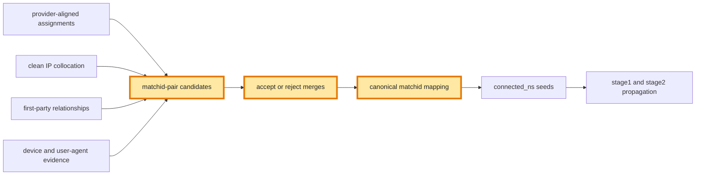

# Matchid Reconciliation Using Collocation Evidence

## Status

This document proposes a collocation-based reconciliation stage. No production change described here has been implemented.

## Scope

This plan covers one problem only: several already-assigned UIDs can carry different matchids even when strong NScreen relationship evidence indicates one identity.

Provider-source multi-assignment is separate. Cases where one vendor gives one UID several matchids are covered by [`provider-source-multi-assignment-plan.md`](provider-source-multi-assignment-plan.md).

## Target outcome

Collocation evidence should be able to merge supported matchid groups before ordinary propagation:

```text
strong relationship evidence
        +
compatible device evidence
        ↓
one canonical matchid component
```

Reconciliation must remain provider-neutral. LiveRamp, Throtle, Experian, propagated identities, and clustered identities should use identical evidence rules.

## Current limitation

Provider alignment runs before graph propagation. `NScreenLiverampThrotleExNStage.sql` then removes already-assigned UIDs inside `filter_out_having_matchid`.

The toy case demonstrates the gap:

- `v9` carries LiveRamp matchid `L1`.
- `v24`, `v25`, and `v26` carry Throtle matchid `T6`.
- Clean collocation edges connect `v9` to each `T6` UID.
- Every endpoint already has a matchid.
- Propagation therefore changes nothing.

Current output remains split between `L1` and `T6`. Collocation makes these UIDs graph-connected but never reconciles their existing assignments.

## Evidence inputs

### Positive evidence

- First-party relationships.
- `samedevice = true`.
- Compatible normalized user-agent attributes.
- Repeated IP collocation across several days.
- High or persistent collocation weight.
- Several independent UID links between two matchid groups.
- Stable historical agreement.

### Negative evidence

- `differentusers = true`.
- Incompatible device classes.
- Incompatible normalized user-agent profiles.
- Geographic or temporal contradictions.
- Excessive component growth.
- Competing strong candidate components.

`differentusers = false` is not positive evidence by itself. Existing device comparison can return false when device data is missing or incomparable.

## Pipeline position

Run reconciliation after provider alignment and before `connected_ns` selection and `stage1` propagation.



## Proposed algorithm

### 1. Attach assignments to edge endpoints

Join both endpoints from clean IP-collocation and first-party relations to current UID-to-matchid assignments. Keep edges where endpoints carry different matchids.

### 2. Aggregate matchid-pair support

For every unordered matchid pair, retain:

- distinct supporting UID pairs;
- distinct supporting UIDs per side;
- first-party relationship count;
- collocation count and total weight;
- repeated-day count;
- same-device count;
- different-user conflict count;
- compatible and incompatible device counts;
- current group sizes;
- proposed merged size.

One shared IP event must never merge identities.

### 3. Apply hard vetoes

Reject candidates carrying:

- any trusted `differentusers = true` conflict;
- incompatible device-class evidence;
- incompatible normalized user-agent evidence;
- excessive proposed growth;
- unresolved competition between similarly supported candidates.

### 4. Accept conservative evidence paths

Initial accepted paths should require independently reinforcing signals. Candidate examples include:

- first-party support plus compatible devices;
- `samedevice = true` plus repeated collocation;
- several independent UID links plus repeated-day support;
- strong repeated collocation plus compatible user agents.

Exact thresholds remain open. Production distributions must determine them.

### 5. Form constrained components

Create canonical components from accepted matchid-pair edges. Recheck every component expansion for conflicts, size growth, and evidence density.

Do not use unconstrained transitive closure. Individually plausible edges can otherwise create implausibly large identities.

### 6. Assign stable canonical IDs

Map each accepted component to one provider-neutral canonical matchid. Preserve a crosswalk from every original matchid.

Canonical IDs should remain stable when components gain new supported members. A persistent registry is preferable to hashing every current member.

### 7. Feed downstream propagation

Rewrite reconciled UID assignments before `connected_ns`. Existing propagation can then continue assigning previously unassigned neighbors.

Remainder selection must treat reconciled UIDs as assigned so they cannot re-enter Louvain.

## Lineage requirements

Retain these fields for every merge decision:

- processing day;
- original matchids;
- canonical matchid;
- supporting UID pairs;
- evidence counts and weights;
- first-party support;
- `samedevice` support;
- `differentusers` conflicts;
- device compatibility;
- decision tier;
- rejection reason;
- component size before and after merging.

## Shadow validation

Compare current and proposed outputs using:

- accepted and rejected matchid pairs;
- distinct matchid reduction;
- UID coverage;
- component-size percentiles;
- largest component growth;
- different-user conflicts;
- assignments by evidence path;
- day-over-day canonical-ID stability;
- sampled user-agent and device evidence.

Any accepted component containing trusted conflicting-user evidence is a blocking defect.

## Acceptance criteria

1. Existing assignments can reconcile through strong collocation evidence.
2. Provider names never determine merge direction.
3. Shared IP alone never triggers merging.
4. `samedevice = true` supports reconciliation.
5. `differentusers = true` blocks reconciliation.
6. `differentusers = false` never acts alone.
7. Component growth remains constrained.
8. Canonical mappings remain auditable.
9. Ordinary unassigned-UID propagation remains stable.
10. Canonical IDs remain stable across ordinary growth.

## Toy coverage

- `v9` with `v24`/`v25`/`v26`: supported cross-provider candidate.
- First-party relationship with compatible devices: accepted path.
- Repeated same-device collocation: accepted path.
- Shared IP without reinforcement: rejected path.
- `differentusers = true`: rejected path.
- Conflicting user agents: rejected path.
- Competing equally supported components: rejected path.
- Transitive chain causing excessive growth: rejected path.
- Component growth across days without canonical-ID churn.

## Open decisions

- Which evidence combinations qualify?
- Which signals are hard vetoes?
- How many repeated days suffice?
- Should first-party evidence bypass weight thresholds?
- What component-growth limits are safe?
- Which persistent canonical-ID mechanism should be used?
- How should canonical splits be handled?
- Which stage and reason codes should represent reconciliation?

## Suggested implementation order

1. Build diagnostic matchid-pair candidates.
2. Profile positive and negative evidence.
3. Select conservative thresholds.
4. Extend toy coverage.
5. Implement shadow merge decisions.
6. Add canonical-ID registry prototype.
7. Rewrite assignments in shadow output.
8. Feed reconciled seeds into propagation.
9. Compare quality, coverage, and stability.
10. Promote after manual review.
