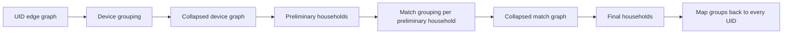

# How `UDAFCalcScreen7IdsEvaluator` groups UIDs

This guide explains `UDAFCalcScreen7IdsEvaluator` without assuming any Java
knowledge. The important idea is that the function receives graph edges and
returns several levels of identity grouping for every UID found in those
edges.

The grouping hierarchy is:

```text
UID -> device -> match -> household
```

The most important invariant is:

> Once UIDs are placed in the same device, later steps cannot separate them.
> Once devices are placed in the same match, the final household step cannot
> separate them.

Later steps work with whole device or match groups, rather than reopening the
groups and processing their members individually.

## Where the function runs

Spark registers the function in
[`common.py`](../src/nscreen_graph/spark/common.py#L29-L32) using
[`UDAFCalcScreen7IdsResolver`](../../src/jvm/com/pulsepoint/hive/udf/calcscreen7ids/UDAFCalcScreen7IdsResolver.java#L7-L10).
The resolver contains no grouping logic. It only tells Spark and Hive to use
[`UDAFCalcScreen7IdsEvaluator`](../../src/jvm/com/pulsepoint/hive/udf/calcscreen7ids/UDAFCalcScreen7IdsEvaluator.java#L18).

Production calls the function from
[`NScreenExRemainderLouvainStage.sql`](../src/nscreen_graph/spark/sparksql/NScreenExRemainderLouvainStage.sql#L13-L23):

```sql
select
    hudf_calc_screen7_ids_udaf(
        murmur3(uid1),
        murmur3(uid2),
        weight,
        samedevice,
        differentusers
    ) as result_per_geo
from remainder
group by geo
```

A UDAF is an aggregate function. A normal function processes one row at a
time. This UDAF collects all edge rows belonging to one SQL group, builds one
graph from them, and returns an array of UID assignments.

Here, `group by geo` defines the boundary. One invocation sees one geographic
graph. The Java code does not receive `geo` and cannot join or reconcile groups
from different geographies.

UID strings are converted to numeric `long` values with `murmur3` before the
UDAF runs. Afterward, SQL joins those hashes back to the original UID strings.

## Inputs and output

Each input row describes one undirected relationship:

| Input | Java type | Meaning |
| --- | --- | --- |
| `uid1` | `long` | Numeric hash for the first UID. |
| `uid2` | `long` | Numeric hash for the second UID. |
| `weight` | `float` | Strength of evidence connecting the UIDs. |
| `sameDevice` | `boolean` | Evidence that both UIDs represent the same physical device. |
| `differentUsers` | `boolean` | Evidence that both UIDs belong to different people. |

The output type is:

```text
array<struct<
    uid: long,
    deviceid: long,
    matchid: long,
    householdid: long
>>
```

One struct is returned for every distinct UID appearing as either endpoint of
an input edge. A UID with no edge cannot be supplied to this UDAF, so it cannot
appear in the output.

## Evaluator lifecycle

Most code inside `UDAFCalcScreen7IdsEvaluator` is Spark/Hive integration code.
Actual identity grouping happens inside
[`Screen7IdCalculatorDHMH.calculateIds`](../../src/jvm/com/pulsepoint/hive/udf/calcscreen7ids/calc/Screen7IdCalculatorDHMH.java#L43-L84).

Spark may process one geographic group across several partitions. These Java
methods let it collect and combine those pieces:

| Java method | Plain-language meaning |
| --- | --- |
| `init` | Read input types and declare the output structure. |
| `getNewAggregationBuffer` | Create an empty list for edges. |
| `iterate` | Convert one SQL row into an `Edge` and append it. |
| `terminatePartial` | Serialize one partition's complete edge list into binary data. |
| `merge` | Deserialize another partition's list and append every edge. |
| `terminate` | Run `Screen7IdCalculatorDHMH` on the complete list. |

Partition boundaries do not become identity boundaries. Every partial list for
the same SQL group is merged before grouping starts.

The evaluator does not deduplicate edges. Duplicate input rows reach the
calculator separately; cross-group weights are summed, while internal edges
are reduced to a tiny self-edge during collapse. It also holds the complete
edge list in memory for each active group;
grouping is not performed incrementally.

## Grouping flow

For interactive graphs of the dataset below, open the
[Streamlit walkthrough](screen7_graph_app/README.md). It displays each step's
relationships, cumulative identity mappings, UID outputs, and Java source lines.
It replays this fixed, Java-verified example rather than running a general
clustering implementation in Python.

The following **complete eleven-row dataset** is used through all seven steps.
All rows belong to one `geo`. `u1` through `u12` stand for the numeric UID hashes
received by the Java evaluator, not additional inputs or preassigned groups.
For an evaluator-level test, use long values `u1 = 1`, `u2 = 2`, and so on
through `u12 = 12`. These are illustrative numeric inputs, not the actual
`murmur3` hashes of the strings `"u1"` through `"u12"`.

| Row | `uid1` | `uid2` | `weight` | `sameDevice` | `differentUsers` |
| --- | --- | --- | --- | --- | --- |
| A | u1 | u2 | 10.0 | true | false |
| B | u1 | u3 | 4.0 | false | false |
| C | u2 | u3 | 3.0 | false | false |
| D | u4 | u5 | 10.0 | true | false |
| E | u4 | u6 | 6.0 | false | false |
| F | u3 | u4 | 1.0 | false | false |
| G | u7 | u8 | 10.0 | true | false |
| H | u7 | u9 | 2.0 | false | true |
| I | u10 | u11 | 10.0 | true | false |
| J | u10 | u12 | 3.0 | false | true |
| K | u1 | u7 | 0.25 | false | false |

These are undirected edges. Rows A, D, G, and I identify four same-device
pairs. Rows B+C and E strongly connect the first two pairs to another UID.
Rows H and J connect different users. Rows F and K are weaker bridges between
groups; unlike the previous example, some preliminary households are connected.

The walkthrough produces **8 devices, 4 preliminary households, 6 internal
matches, and 3 final households**. In Step 6, match `M2` moves from `H2` to
`H1`, carrying `u4`, `u5`, and `u6` together. `H2` then disappears. The
final households are `H1`, `H3`, and `H4`.

There are no other input rows. In particular, device IDs are **calculated in
Step 1**, not supplied alongside the edges. `D1`, `M1`, and `H1` below are
readable names for generated numeric labels. The walkthrough tracks exact
membership and weights, rather than predicting the random numeric IDs.



`DHMH` in `Screen7IdCalculatorDHMH` describes this order:

```text
Device -> Household -> Match -> Household
```

The first household is temporary. It bounds the match calculation. Only the
second household assignment is returned.

## Step 1: build device groups

Source: [Screen7IdCalculatorDHMH.java:47](../../src/jvm/com/pulsepoint/hive/udf/calcscreen7ids/calc/Screen7IdCalculatorDHMH.java#L47)
filters and groups same-device edges;
[Screen7IdCalculatorDHMH.java:157](../../src/jvm/com/pulsepoint/hive/udf/calcscreen7ids/calc/Screen7IdCalculatorDHMH.java#L157)
adds missing UID mappings. The size-limited move score is in
[GlobalLabelPropAlgo.java:17](../../src/jvm/com/pulsepoint/hive/udf/louvain/GlobalLabelPropAlgo.java#L17).

The calculator first keeps only edges where `sameDevice = true`. It runs a
weighted, size-limited label-propagation algorithm over those edges.

Every UID in this filtered graph begins in its own temporary community.
The algorithm repeatedly
considers moving a UID into a neighboring community. Stronger connecting
weights favor a move, while a size penalty makes larger communities harder to
join. No device community may contain more than five UIDs.

This is not a simple connected-components calculation. A chain of
`sameDevice` edges does not automatically guarantee one device group. Edge
weights, processing order, ties, and the five-UID limit can split a connected
component.

UIDs appearing only on `sameDevice = false` edges are absent from this first
graph. Each such UID receives its own generated device ID.

`differentUsers` is not checked during this step. If one edge is
simultaneously marked `sameDevice = true` and `differentUsers = true`, the
same-device evidence can group those UIDs first. Later steps cannot undo that
device group.

Result after this step:

```text
uid -> deviceid
```

Every input UID maps to exactly one device ID within this UDAF invocation.

**Our dataset:** only rows A, D, G, and I pass `sameDevice = true`. They form
four separate devices. `u3`, `u6`, `u9`, and `u12` are absent from that
filtered graph, so the calculator adds a separate device ID for each.

| UID | Calculated device ID | Why |
| --- | --- | --- |
| u1 | D1 | Row A groups u1 and u2. |
| u2 | D1 | Row A groups u1 and u2. |
| u3 | D2 | No same-device edge includes u3. |
| u4 | D3 | Row D groups u4 and u5. |
| u5 | D3 | Row D groups u4 and u5. |
| u6 | D4 | No same-device edge includes u6. |
| u7 | D5 | Row G groups u7 and u8. |
| u8 | D5 | Row G groups u7 and u8. |
| u9 | D6 | No same-device edge includes u9. |
| u10 | D7 | Row I groups u10 and u11. |
| u11 | D7 | Row I groups u10 and u11. |
| u12 | D8 | No same-device edge includes u12. |

Thus `device(u1) = D1` and `device(u2) = D1` describe Step 1's output.
In this example, their shared device comes from the explicitly listed edge
`u1 -- u2`. More generally, same-device grouping can involve paths through
other UIDs; shared membership does not require a direct edge between every pair.

## Step 2: collapse the UID graph

Source: [Screen7IdCalculatorDHMH.java:52](../../src/jvm/com/pulsepoint/hive/udf/calcscreen7ids/calc/Screen7IdCalculatorDHMH.java#L52)
calls `collapseGraph` with conflict propagation enabled. Its implementation at
[Screen7IdCalculatorDHMH.java:183](../../src/jvm/com/pulsepoint/hive/udf/calcscreen7ids/calc/Screen7IdCalculatorDHMH.java#L183)
maps endpoints, sums cross-device weights, and creates tiny self-edges.

The calculator now replaces every UID endpoint with its device ID. UIDs sharing
one device become one graph node.

**Our dataset:** replace both endpoints of **every original row**, including
rows A, D, G, and I, using the mapping from Step 1.

| Original row | UID edge | Device edge | Treatment |
| --- | --- | --- | --- |
| A | u1 -- u2, weight 10 | D1 -- D1 | Replace internal weight with 0.00001. |
| B | u1 -- u3, weight 4 | D1 -- D2 | Combine with row C. |
| C | u2 -- u3, weight 3 | D1 -- D2 | Combine with row B. |
| D | u4 -- u5, weight 10 | D3 -- D3 | Replace internal weight with 0.00001. |
| E | u4 -- u6, weight 6 | D3 -- D4 | Keep weight 6. |
| F | u3 -- u4, weight 1 | D2 -- D3 | Keep the weight-1 bridge. |
| G | u7 -- u8, weight 10 | D5 -- D5 | Replace internal weight with 0.00001. |
| H | u7 -- u9, weight 2 | D5 -- D6 | Keep weight 2 and the conflict flag. |
| I | u10 -- u11, weight 10 | D7 -- D7 | Replace internal weight with 0.00001. |
| J | u10 -- u12, weight 3 | D7 -- D8 | Keep weight 3 and the conflict flag. |
| K | u1 -- u7, weight 0.25 | D1 -- D5 | Keep the weight-0.25 bridge. |

The complete collapsed graph has ten edges:

| Endpoint 1 | Endpoint 2 | `weight` | `sameDevice` | `differentUsers` |
| --- | --- | --- | --- | --- |
| D1 | D1 | 0.00001 | false | false |
| D1 | D2 | 7.0 (= 4 + 3) | false | false |
| D3 | D3 | 0.00001 | false | false |
| D3 | D4 | 6.0 | false | false |
| D2 | D3 | 1.0 | false | false |
| D5 | D5 | 0.00001 | false | false |
| D5 | D6 | 2.0 | false | true |
| D7 | D7 | 0.00001 | false | false |
| D7 | D8 | 3.0 | false | true |
| D1 | D5 | 0.25 | false | false |

So **yes, row A becomes `D1 -- D1`**. That self-edge exists alongside
`D1 -- D2`; it does not replace the edges to another device. The internal
weight 10 is not added to the external weight 7.

This collapse carries evidence forward using these rules:

- Weights from parallel edges between the same two devices are summed.
- If any contributing cross-device edge has `differentUsers = true`, the
  collapsed device edge has `differentUsers = true`.
- Edges whose endpoints already share one device become one tiny self-edge
  per device with weight `0.00001`, regardless of their original weights or
  count. Both flags on that self-edge are false.
- `sameDevice` is no longer used after device grouping.

From this point onward, a device is atomic. Later algorithms can move `D1`, but
they cannot put `u1` and `u2` into different matches or households.

## Step 3: build preliminary households

Source: [Screen7IdCalculatorDHMH.java:54](../../src/jvm/com/pulsepoint/hive/udf/calcscreen7ids/calc/Screen7IdCalculatorDHMH.java#L54)
configures and runs this household pass;
[LabelPropAlgo.java:41](../../src/jvm/com/pulsepoint/hive/udf/louvain/LabelPropAlgo.java#L41)
implements repeated community moves using the score in
[GlobalLabelPropAlgo.java:17](../../src/jvm/com/pulsepoint/hive/udf/louvain/GlobalLabelPropAlgo.java#L17).

The calculator runs weighted label propagation over the device graph. Each
community may contain at most 50 device IDs.

This pass uses all device-level relationships and their summed weights. It does
not honor `differentUsers`. Its purpose is to create bounded neighborhoods for
the more expensive match calculation.

These preliminary household assignments are internal working state. The final
pass decides the returned `householdid` assignments and may retain these same
numeric labels, as it does in this example.

**Our dataset:** this pass produces **four preliminary household IDs**:
`H1 = {D1, D2}`, `H2 = {D3, D4}`, `H3 = {D5, D6}`, and `H4 = {D7, D8}`.
Each group contains two devices, below the 50-device limit.

The strong within-pair connections have weights 7, 6, 2, and 3. The bridges
between pairs have weights only 1 and 0.25. Once these pairs form, a device
would lose more support by leaving its partner than it gains by crossing a
bridge. The small size penalties do not reverse that comparison here.

Thus a connecting edge does **not** automatically mean one household.
`H1`, `H2`, and `H3` stay separate even though bridges connect them.
`H4` has no connection to the other groups. The `differentUsers` flags on
`D5 -- D6` and `D7 -- D8` are ignored in this pass.

| Device ID | Preliminary household ID |
| --- | --- |
| D1 | H1 |
| D2 | H1 |
| D3 | H2 |
| D4 | H2 |
| D5 | H3 |
| D6 | H3 |
| D7 | H4 |
| D8 | H4 |

Step 4 will make four separate Louvain calls with these complete edge lists:

| Preliminary household | Edges supplied to its Louvain call |
| --- | --- |
| H1 | D1 -- D1 (0.00001), D1 -- D2 (7) |
| H2 | D3 -- D3 (0.00001), D3 -- D4 (6) |
| H3 | D5 -- D5 (0.00001), D5 -- D6 (2, differentUsers) |
| H4 | D7 -- D7 (0.00001), D7 -- D8 (3, differentUsers) |

These are eight of the ten edges from Step 2. Bridges F (`D2 -- D3`) and
K (`D1 -- D5`) cross preliminary household boundaries, so they are **excluded
from Step 4 only**. They remain in the complete device graph used by Step 5.

## Step 4: build match groups

Source: [Screen7IdCalculatorDHMH.java:60](../../src/jvm/com/pulsepoint/hive/udf/calcscreen7ids/calc/Screen7IdCalculatorDHMH.java#L60)
configures Louvain and runs it per preliminary household;
[Screen7IdCalculatorDHMH.java:133](../../src/jvm/com/pulsepoint/hive/udf/calcscreen7ids/calc/Screen7IdCalculatorDHMH.java#L133)
selects each household's internal edges. Modularity scoring is in
[LouvainAlgo.java:17](../../src/jvm/com/pulsepoint/hive/udf/louvain/LouvainAlgo.java#L17),
and direct conflict checking is in
[Graph.java:94](../../src/jvm/com/pulsepoint/hive/udf/louvain/Graph.java#L94).

Louvain-style community detection runs separately inside every preliminary
household. Its graph nodes are device IDs, not individual UIDs.

This pass uses edge weights and honors `differentUsers`. A device cannot join
a match community containing another device connected to it by a direct
`differentUsers = true` edge.

The conflict check is direct, not transitive. It checks explicit edges from the
device being moved to devices already in the candidate community. It does not
infer additional conflicts between unconnected devices.

Louvain is configured with a limit of 10,000 device nodes per match community.
In this calculator, each Louvain call is already scoped to a preliminary
household containing at most 50 devices. Therefore, the outer 50-device limit
normally binds first.

Devices grouped into one match become atomic for the final step. Later
household grouping cannot split them.

Devices placed in different preliminary households cannot share one match,
because each Louvain run sees only its own preliminary household.

Result after this step:

```text
deviceid -> matchid
```

**Our dataset:** Louvain runs separately inside all four households, starting with
a separate match community per device in each call.

Inside `H1`, `D1` and `D2` join `M1`; inside `H2`, `D3` and `D4` join
`M2`. Their weight-7 and weight-6 connections give positive modularity gains.
Inside `H3`, `D5` and `D6` stay in separate matches `M3` and `M4` because
of their different-user edge. The same rule keeps `D7` and `D8` in `M5`
and `M6` inside `H4`.

| Device ID | Internal match ID | Original UIDs |
| --- | --- | --- |
| D1 | M1 | u1, u2 |
| D2 | M1 | u3 |
| D3 | M2 | u4, u5 |
| D4 | M2 | u6 |
| D5 | M3 | u7, u8 |
| D6 | M4 | u9 |
| D7 | M5 | u10, u11 |
| D8 | M6 | u12 |

Each internal match inherits its preliminary household as the starting
assignment for Step 6: `M1 -> H1`, `M2 -> H2`, `M3 -> H3`, `M4 -> H3`,
`M5 -> H4`, `M6 -> H4`. All six are nonzero internal match IDs.
Conversion to the output sentinel `0` happens only in Step 7.

## Step 5: collapse the device graph

Source: [Screen7IdCalculatorDHMH.java:77](../../src/jvm/com/pulsepoint/hive/udf/calcscreen7ids/calc/Screen7IdCalculatorDHMH.java#L77)
calls `collapseGraph` with conflict propagation disabled. It reuses
[Screen7IdCalculatorDHMH.java:183](../../src/jvm/com/pulsepoint/hive/udf/calcscreen7ids/calc/Screen7IdCalculatorDHMH.java#L183)
with device-to-match mappings instead of UID-to-device mappings.

Every device endpoint is replaced with its match ID. Parallel edge weights are
summed again, producing a match-level graph.

Unlike the device collapse, this collapse deliberately does not copy the
`differentUsers` flag. Different people may belong to one household, so that
conflict must prevent a shared match without preventing a shared household.

**Our dataset:** apply the device-to-match mapping to **every edge from
Step 2**, including bridges F and K that were excluded from the Louvain calls.

| Device edge | Match edge | Treatment |
| --- | --- | --- |
| D1 -- D1, weight 0.00001 | M1 -- M1 | One self-edge of weight 0.00001. |
| D1 -- D2, weight 7 | M1 -- M1 | Same self-edge; weight 7 is discarded. |
| D3 -- D3, weight 0.00001 | M2 -- M2 | One self-edge of weight 0.00001. |
| D3 -- D4, weight 6 | M2 -- M2 | Same self-edge; weight 6 is discarded. |
| D2 -- D3, weight 1 | M1 -- M2 | Keep the weight-1 bridge from F. |
| D5 -- D5, weight 0.00001 | M3 -- M3 | One self-edge of weight 0.00001. |
| D5 -- D6, weight 2 | M3 -- M4 | Keep weight 2; drop conflict flag. |
| D7 -- D7, weight 0.00001 | M5 -- M5 | One self-edge of weight 0.00001. |
| D7 -- D8, weight 3 | M5 -- M6 | Keep weight 3; drop conflict flag. |
| D1 -- D5, weight 0.25 | M1 -- M3 | Keep the weight-0.25 bridge from K. |

The complete match graph is:

| Endpoint 1 | Endpoint 2 | `weight` | `sameDevice` | `differentUsers` |
| --- | --- | --- | --- | --- |
| M1 | M1 | 0.00001 | false | false |
| M2 | M2 | 0.00001 | false | false |
| M1 | M2 | 1.0 | false | false |
| M3 | M3 | 0.00001 | false | false |
| M3 | M4 | 2.0 | false | false |
| M5 | M5 | 0.00001 | false | false |
| M5 | M6 | 3.0 | false | false |
| M1 | M3 | 0.25 | false | false |

As in Step 2, internal edges become one tiny self-edge per group; their
weights are not summed. No `M4 -- M4` or `M6 -- M6` edge is invented: none
of the supplied device edges has both endpoints in either of those matches.
This changes the next decision: the strong weight-7 and weight-6 edges now
sit *inside* `M1` and `M2` and have been replaced by tiny self-edges. The
weight-1 bridge still connects the two complete matches.

## Step 6: build final households

Source: [Screen7IdCalculatorDHMH.java:80](../../src/jvm/com/pulsepoint/hive/udf/calcscreen7ids/calc/Screen7IdCalculatorDHMH.java#L80)
configures the 100-match limit and runs this pass;
[LabelPropAlgo.java:32](../../src/jvm/com/pulsepoint/hive/udf/louvain/LabelPropAlgo.java#L32)
starts from the supplied household mapping rather than creating new labels.

The calculator runs weighted label propagation over the complete match graph.
It starts from the preliminary household assignments, but match IDs may move or
recombine based on graph weights. A final household may contain at most 100
match IDs.

`differentUsers` is not honored here. Two match groups separated by explicit
different-user evidence can still share a household.

Result after this step:

```text
matchid -> householdid
```

**Our dataset:** `M2` moves from `H2` to `H1`. This carries all of `u4`,
`u5`, and `u6` into the new household without splitting their device or match
groups. The other five match assignments stay unchanged.

Why this move happens:

1. `M2` starts alone in `H2`. Leaving a singleton community has score 0.
2. Its edge to `M1` has weight 1. Joining `H1`, currently containing only
   `M1`, scores `1 * (1 - (1 / 100)^2) = 0.9999`. This beats 0 plus the
   initial move threshold `0.000001`.
3. The pass visits nodes in increasing incident-weight order. `M2` has
   approximately `1.00001`; `M1` has `1.25001` because of the extra bridge
   to `M3`. Thus `M2` moves first, and `H1` is the surviving label.
4. After that move, the weight-1 tie keeps `M1` and `M2` together. The
   weight-0.25 bridge is too weak to pull `M1` into `H3` or `M3` into
   `H1`. `H3` and `H4` retain their weight-2 and weight-3 pairs.

The move score is implemented in
[GlobalLabelPropAlgo.java:17](../../src/jvm/com/pulsepoint/hive/udf/louvain/GlobalLabelPropAlgo.java#L17),
singleton leaving score in
[GlobalLabelPropAlgo.java:40](../../src/jvm/com/pulsepoint/hive/udf/louvain/GlobalLabelPropAlgo.java#L40),
and node ordering in [Graph.java:47](../../src/jvm/com/pulsepoint/hive/udf/louvain/Graph.java#L47).

| Internal match ID | Preliminary household | Final household | Change |
| --- | --- | --- | --- |
| M1 | H1 | H1 | Stays. |
| M2 | H2 | H1 | Moves with u4, u5, u6. |
| M3 | H3 | H3 | Stays. |
| M4 | H3 | H3 | Stays. |
| M5 | H4 | H4 | Stays. |
| M6 | H4 | H4 | Stays. |

`H2` becomes empty. The final groups are `H1 = {M1, M2}`,
`H3 = {M3, M4}`, and `H4 = {M5, M6}`: three households, each with two
internal matches. All three returned household IDs are therefore nonzero.
The pass reuses existing labels; it does not mint a new household ID to
represent this change. There are more final households than in the previous
two-household example, but within this run the count decreases from four to three.

## Step 7: map results back to UIDs

Source: [Screen7IdCalculatorDHMH.java:87](../../src/jvm/com/pulsepoint/hive/udf/calcscreen7ids/calc/Screen7IdCalculatorDHMH.java#L87)
builds one result per UID;
[Screen7IdCalculatorDHMH.java:109](../../src/jvm/com/pulsepoint/hive/udf/calcscreen7ids/calc/Screen7IdCalculatorDHMH.java#L109)
follows the mappings and applies singleton sentinels. Finally,
[UDAFCalcScreen7IdsEvaluator.java:98](../../src/jvm/com/pulsepoint/hive/udf/calcscreen7ids/UDAFCalcScreen7IdsEvaluator.java#L98)
calls the calculator and formats its results into the returned array.

For every original edge endpoint, the calculator follows the completed maps:

```text
uid -> deviceid -> matchid -> householdid
```

It stores results by UID, so a UID appearing in many edges is returned only
once within one UDAF invocation.

This mapping explains how UIDs stay grouped:

- UIDs sharing one `deviceid` always share one `matchid` and `householdid`.
- Devices sharing one internal match group always share one household group.
- Higher levels can merge lower-level groups, but cannot split them.
- Preliminary households can change because they are only calculation scopes.

**Our dataset:** the completed internal paths are:

| UID | Device ID | Internal match ID | Internal household ID |
| --- | --- | --- | --- |
| u1 | D1 | M1 | H1 |
| u2 | D1 | M1 | H1 |
| u3 | D2 | M1 | H1 |
| u4 | D3 | M2 | H1 |
| u5 | D3 | M2 | H1 |
| u6 | D4 | M2 | H1 |
| u7 | D5 | M3 | H3 |
| u8 | D5 | M3 | H3 |
| u9 | D6 | M4 | H3 |
| u10 | D7 | M5 | H4 |
| u11 | D7 | M5 | H4 |
| u12 | D8 | M6 | H4 |

The calculator then applies its singleton rules, explained below.
`M1` and `M2` each contain two devices, so both remain nonzero. `M3` and
`M5` each contain one device with two UIDs, so they also remain nonzero.
`M4` and `M6` each contain one device with one UID, so **u9's and u12's
returned `matchid` values become `0`**. The household calculation has
already used the distinct internal IDs `M4` and `M6`; the shared output
sentinel does not combine these users or their households.

The evaluator returns this array of structs, shown as a table for readability:

| `uid` | `deviceid` | `matchid` | `householdid` |
| --- | --- | --- | --- |
| u1 | D1 | M1 | H1 |
| u2 | D1 | M1 | H1 |
| u3 | D2 | M1 | H1 |
| u4 | D3 | M2 | H1 |
| u5 | D3 | M2 | H1 |
| u6 | D4 | M2 | H1 |
| u7 | D5 | M3 | H3 |
| u8 | D5 | M3 | H3 |
| u9 | D6 | 0 | H3 |
| u10 | D7 | M5 | H4 |
| u11 | D7 | M5 | H4 |
| u12 | D8 | 0 | H4 |

All twelve input UIDs are returned exactly once. Table order is illustrative;
the evaluator does not guarantee array ordering.

## Why some output IDs are zero

Zero is a sentinel for a trivial higher-level group. It does not mean the UID
was lost or processing failed.

| Output field | When zero is returned |
| --- | --- |
| `deviceid` | Never intentionally. Even a singleton UID gets a generated device ID. |
| `matchid` | Only when the match contains one device **and** that device contains one UID. |
| `householdid` | When the final household contains only one match ID. |

A single device containing several same-device UIDs therefore keeps a nonzero
`matchid`, even when no other device joins that match. A large match can still
receive `householdid = 0` when it is the household's only match.

Production SQL later keeps `matchid` and `householdid` but discards `deviceid`.
The final-result SQL also removes every row with `matchid = 0`, even when that
row has a nonzero `householdid`.

For the running example, the UDAF returns all twelve rows above. The downstream
final-result filter removes `u9` and `u12` because their returned `matchid`
values are zero. The remaining ten rows still include `H1`, `H3`, and `H4`.
That filtering is SQL behavior, not a removal performed by the evaluator.

## Small grouping examples

Generated numeric IDs have no business meaning. These examples use `D1`, `M1`,
and `H1` so group membership stays visible.

Assume each example is one isolated UDAF invocation with one edge of weight
`1.0`. The ordinary and different-user examples have `sameDevice = false`;
only the different-user example has `differentUsers = true`.

| Relationship | Device result | Match result | Household result |
| --- | --- | --- | --- |
| `u1 --sameDevice--> u2` | Both use `D1`. | Both use nonzero `M1`, because `D1` contains two UIDs. | Both use `0`, because only one match exists. |
| `u1 --ordinary edge--> u2` | `D1` and `D2`. | Both can use `M1` when Louvain groups both devices. | Both use `0`, because only one match exists. |
| `u1 --differentUsers--> u2` | `D1` and `D2`. | They cannot share a match; each singleton reports `0`. | They can share nonzero `H1`, because two different people may share a household. |

For a larger example, suppose same-device evidence groups `u1` and `u2` into
`D1`. After that collapse, every later pass sees only `D1`. No later match or
household decision can separate `u1` from `u2`.

## What each input flag controls

| Stage | Uses `weight` | Uses `sameDevice` | Honors `differentUsers` |
| --- | --- | --- | --- |
| Device grouping | Yes | Yes; it selects eligible edges. | No |
| Device-graph collapse | Yes; parallel weights are summed. | No | Yes; conflicts are combined with OR. |
| Preliminary household | Yes | No | No |
| Match grouping | Yes | No | Yes |
| Match-graph collapse | Yes; parallel weights are summed. | No | No; conflicts are dropped. |
| Final household | Yes | No | No |

Higher weight generally favors grouping, but it is not an unconditional merge
instruction. Community size, competing edges, modularity, and processing order
also affect the result.

## Stability and interpretation

Device, match, and household labels originate from generated random `long`
values. A group adopts one of those labels. Therefore:

- exact numeric IDs are not stable across executions;
- IDs may be negative;
- output ordering is unspecified;
- equal **nonzero** numeric IDs within the same output field and invocation
  indicate shared membership; `0` is a sentinel shared by unrelated singleton
  results, not an identity group;
- numeric magnitude carries no meaning; and
- IDs should not be compared across days, geographies, or reruns as durable
  identity keys.

On graphs containing equal-gain choices, group membership may also vary. Read
the result as a best-effort clustering of current evidence, not a permanent
identifier assignment. The pipeline reflects this by writing `stable = false`
and `reason = 'LU'`.

## Limits summary

| Level | Maximum community size |
| --- | --- |
| Device | 5 UIDs |
| Preliminary household | 50 device IDs |
| Match | 10,000 device IDs configured; normally bounded by the 50-device preliminary household |
| Final household | 100 match IDs |

Limits count current graph nodes. For example, the final household limit counts
match groups, not raw UIDs.

## Relevant implementation files

| File | Responsibility |
| --- | --- |
| [`UDAFCalcScreen7IdsResolver.java`](../../src/jvm/com/pulsepoint/hive/udf/calcscreen7ids/UDAFCalcScreen7IdsResolver.java) | Connects the SQL function name to the evaluator. |
| [`UDAFCalcScreen7IdsEvaluator.java`](../../src/jvm/com/pulsepoint/hive/udf/calcscreen7ids/UDAFCalcScreen7IdsEvaluator.java) | Collects and merges Spark rows, then formats results. |
| [`Screen7IdCalculatorDHMH.java`](../../src/jvm/com/pulsepoint/hive/udf/calcscreen7ids/calc/Screen7IdCalculatorDHMH.java) | Implements device, match, and household grouping. |
| [`LabelPropAlgo.java`](../../src/jvm/com/pulsepoint/hive/udf/louvain/LabelPropAlgo.java) | Runs repeated community moves. |
| [`GlobalLabelPropAlgo.java`](../../src/jvm/com/pulsepoint/hive/udf/louvain/GlobalLabelPropAlgo.java) | Scores weighted moves with a size penalty. |
| [`LouvainAlgo.java`](../../src/jvm/com/pulsepoint/hive/udf/louvain/LouvainAlgo.java) | Scores match-community moves using modularity. |
| [`Graph.java`](../../src/jvm/com/pulsepoint/hive/udf/louvain/Graph.java) | Builds the undirected graph and checks direct conflicts. |
| [`NScreenExRemainderLouvainStage.sql`](../src/nscreen_graph/spark/sparksql/NScreenExRemainderLouvainStage.sql) | Defines per-geo aggregation and maps hashes back to UIDs. |

Active automated coverage currently verifies only that same-device UID pairs
share a device ID and disconnected pairs receive different device IDs. See
[`test_calc_screen7_ids.py`](../../tests/python/udfs/test_calc_screen7_ids.py).
Match grouping, household grouping, conflict handling, limits, partial merging,
and numeric stability are not covered by active assertions.
